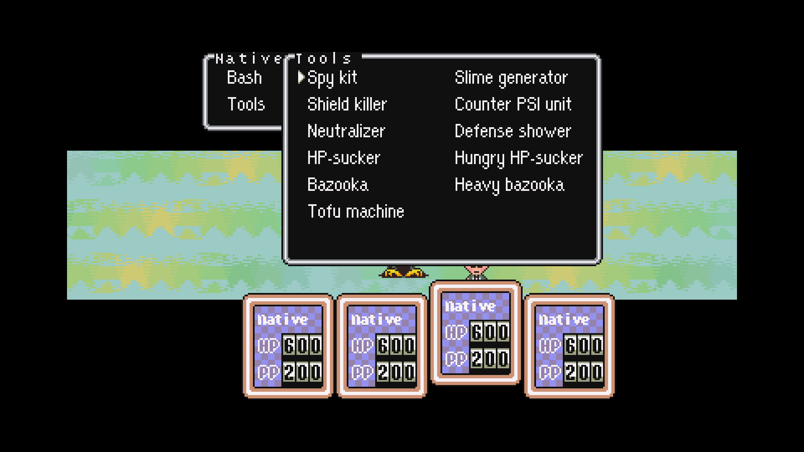
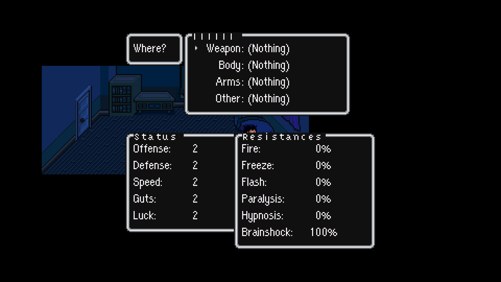
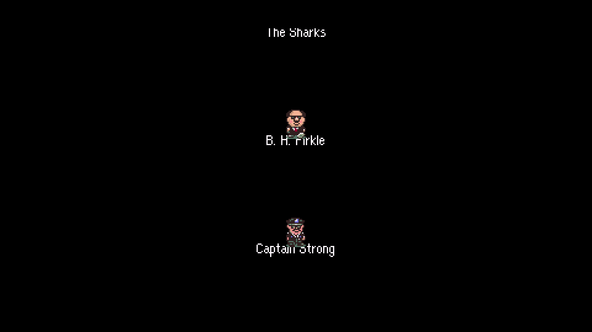
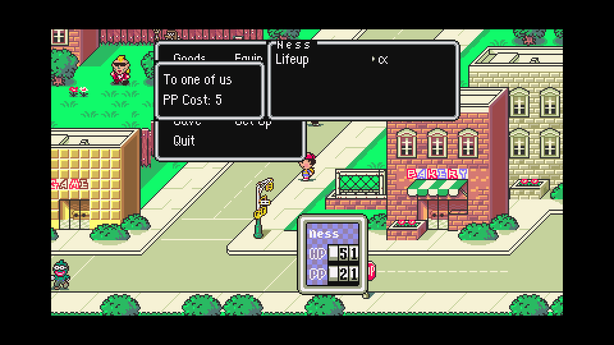
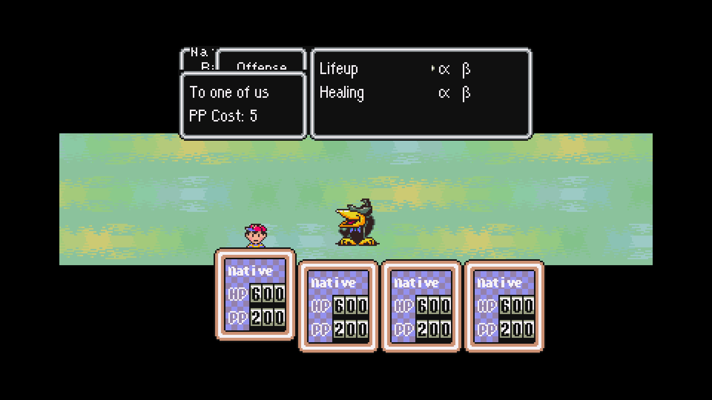
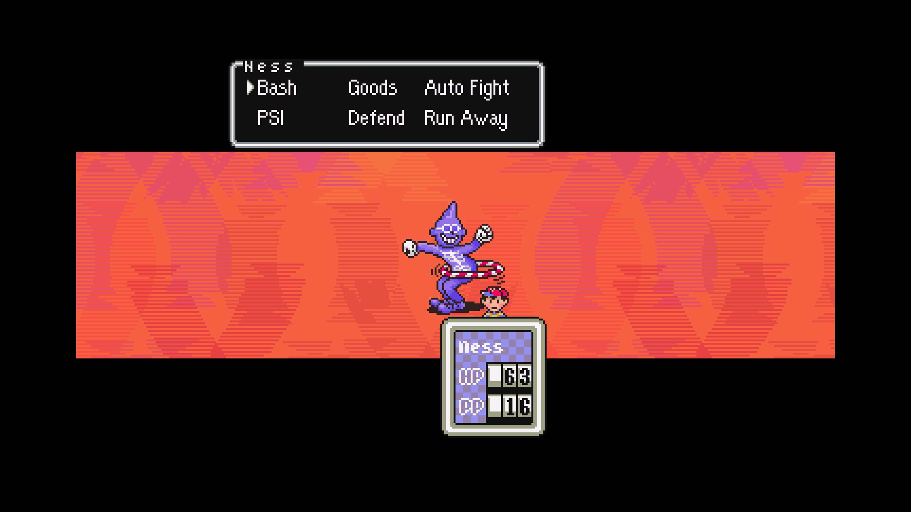

# MaternalBound Redux native port

Companion is adapting MaternalBound Redux into the BrianPugh-derived native x64 C/SDL engine, through Sean Staggs's pinned fork, alongside HD and ultrawide output, MSU music, PC controls, save recovery and Story Shuffle. Gameplay runs as compiled C; patched SNES CPU code requires explicit native implementations. The native foundation remains a current dependency; see [UPSTREAM.md](UPSTREAM.md).

**Full Redux compatibility is incomplete. The older v0.4 preview and existing original-profile installation contain original EarthBound. The new development setup builds a separate native Redux profile locally from your clean ROM. A full story or randomized playthrough remains unverified. ROMs and extracted packs are excluded from the repository and ZIP.**

## Exact upstream target

This checkpoint targets the active upstream source at `897d00833f4a08a0a92f106abf631629a6a6a041`, compiled locally with CoilSnake into a verified 6 MiB ROM. It is not the official v1.1 release. The v1.1 BPS was separately checksum-verified and tested during initial extraction research; supporting that release requires a separate conversion map and validation record.

The bridge records 191 reachable CCS files, 1,018 import edges, 190 compiler modules, 7,840 labels and source checksums. An exact ROM/source mismatch stops conversion. This is a deterministic porting input, not a claim that every upstream assembly feature has been implemented. **Current runtime checkpoint: `v0.5.0-redux-dev.6`.**

The latest fixes resolve the relocated PSI-name table, PSI-window ordering and old-menu repaint on cold restore, an empty Talk/Check window leaking into later combat, Redux cutscene letterboxes overwriting battle masks, a cold-restore level-up cache crash, an attacker-name buffer overread, and the Companion's Redux story backup/launch path. The copied Starman Junior save passes through victory, level-ups and Buzz Buzz dialogue back to roaming. Both the native B status action and the quick Talk/Check action are covered. Repeated empty checks → X leave only the command menu. An ordinary-input empty check → natural Onett battle → victory/roaming also passes; a production render shows the ghost box absent. This is targeted evidence, not a full story playthrough. See [JEV-QA.md](JEV-QA.md) and [validation/](validation/).

The dev.4 audit fixes `CC 1D 15` variable-argument width and adds 25 actual dispatcher cases. The review reproduced eight high-word failures before the fix. All 106 VM checks now pass, alongside movement/combat checks and original-profile regression checks. The pack remains the same as dev.3; quick-save format 16 and existing seed identities are unchanged. A new 20-checkpoint production/observer comparison passes through natural Onett combat. Jev has also earned the Shack Key from the mayor through ordinary story inputs.

Dev.5 fixes gift registers being assigned before the deferred interaction window exists. The real NPC 1414 and 1415 checkpoints reproduce missing item rewards in dev.4; native ordinary-input replays now grant item IDs 224 and 111, set their opened flags, close the dialogue, and reject a second reward. A separate prepared cash-gift fixture grants exactly $123 without duplication. The player engine, observer and frozen setup helper are rebuilt together. This does not rewrite old saves or automatically compensate previously opened presents.

Dev.6 connects the three `refill_stamina_on_heal.ccs` entries to native stamina reset. Literal ROM trampolines did not intercept the relocated native recovery bodies/callers. Native hooks now run once at CALL/direct entry and JUMP entry, without changing the healing bodies, pack or saved instruction offsets. Twelve prepared four-member cases rotate healthy, poisoned, unconscious and diamondized members across hotel/full-heal/hot-spring scripts; all healing/status rules and stamina reset pass after reproducing the omission in dev.5. Twenty-four player/observer checkpoints match. Six production VM cases cover entry jumps and loop continuations. The [three-hook review](research/redux-recovery-hooks-review.json) records the compiled trampolines, aliases and adaptation. These are prepared fixtures, not ordinary playthroughs of all resting locations.

A follow-up [source/data review](research/redux-control-and-battle-hooks-review.json) checks 29 active literal writes across controls, terrain speed, expanded Spy, PSI stat buffs and colored cast text. On the same dev.6 engine, a prepared Spy battle displays the target’s Offense 5, Defense 3 and Speed 77, awards one Cookie to Jeff and returns to the battle menu. All 21 cold-restored input checkpoints match between player and observer builds. These checks do not establish every enemy, map or story branch.

## Implemented development coverage

| Area | Current native work and evidence |
|---|---|
| Dialogue | 7,397 converted spans, 568,999 bytes and 12,859 relocated fields; zero failed spans, unresolved targets or ambiguous original aliases. Seven pinned malformed source jump tables are repaired explicitly and reported. |
| Script extensions | Typed menu, title, fade, money, party, item, timeout and enemy-AI commands. Seventeen stable native adapters replace routine calls. 112 native VM checks and four converted window titles pass. |
| World | Converted maps, palettes, collision, NPC placements, doors, events, movement data, 69 shops, items, PSI configuration, encounter groups, six auxiliary tables and music-zone selection. Native and raw script entry points map to rewritten scripts. |
| Graphics | 483 sprite groups / 4,432 frames, all five fonts, map artwork and battle backgrounds/enemy art. Redux walking/run tables and run sprites are bound to the native animation callbacks. Upstream alternate walking tables share some graphics; cycling the tables does not create missing art. |
| Menu and delivery fixes | Highlighting uses the selected font's rendered widths; ten narrow/wide font cases and row bounds pass. Delivery opens its letterbox through fourteen native frames before music/dismount; the continuation uses scalar modal state. |
| Controls | Redux pause layout, quick check, HP/PP toggle, town map, Keys/Jeff's Tools menus, stamina and exhaustion, including the three rest-script stamina-reset hooks. Production animation/stamina checks and prepared four-member recovery cases pass. |
| Enemy AI | Converted scripts for 190 enemies; the production selector and VM pass 48,640 turns across four HP/PP/status conditions. Action bounds, persistent cursors and retained money rewards are checked. These are selector checks, not full battle playthroughs. |
| Names and saves | Six-letter party names, ten-letter favorite food and 49 expanded default names. Original character/save sizes stay fixed; tagged spare save bytes hold the extra letters. Extended names survive phone saves, old untagged save migration and quick-save reloads. |
| Runtime replays | Real naming input produces `IIIiiI`: Select changes alphabet case and the six letters survive a cold restore. Seven menu cases and eleven shop/Goods/Status replays pass at 1920×1080. Normal-button gameplay also crosses the house doors/stairs and completes Mom's dialogue and clothes-change warp, with cold restores between checkpoints. The same route passes for a generated Redux seed and includes leaving the house and outdoor movement. These checks do not prove every item use or later progression. |
| Battle Tools | Eleven flag-based devices free Jeff's inventory space. A 63-case production battle suite covers availability, paralysis/immobilization, maid handoff, targeting, cancellation, cold restore and actual execution/return of every device. All effect/resistance combinations remain untested. |
| Movement | All 898 roots resolve. Traversal covers 17,688 instructions, 4,471 routine calls, 458 callback reference sites and 54 WRAM sites, with no unresolved targets. Six private helpers explicitly handle distance, unsigned arithmetic, speed, fade and frame updates. Compiled scene-completion writes, invisible controllers and DMA-empty waits pass. Companion additionally ports the optional upstream fast-door hook: 21 exit/palette/brightness cases pass at a timer step of two; the original profile retains a step of one. This hook is disabled in upstream's pinned import list and is an extra Companion QoL change. |
| Presentation | Both title variants complete naturally in 827 frames. Eight flyover narrations, coffee and tea scenes also complete and render at 1080p. Mosaic fade-in finishes at full brightness without residual mosaic. |
| Audio | 191 converted SPC tracks and relocated sample banks; 188 produce samples in 24-frame checks. All 164 verified PCM files pass 125 loop boundaries and 39 one-shot ends. Eight Sound Stone SPC/MSU transitions, retained SPC effects and a missing-PCM fallback pass. The old recording no longer plays under MSU. Listening and every story transition remain unverified. |
| PSI and battle art | All 68 PSI effects run through 1,686 native animation frames and cold-pointer rebinding. Extended battle-art tests decompress 160 enemy images and 46 palettes. Twelve party-sprite variants pass selection, victory and cleanup checks. |
| Combat fixes | Native target Guts, enemy crying, Brain Stone, poison feedback, Franklin Badge/shield handling, stat caps, defending HP rollers, condiment priority and the six-outcome Lucky Sandwich action. Checks include 4,096 sandwich trials, 128 damage trials and 42 condiment records. These do not replace full battle playthroughs. |
| Equipment | Five stat and six resistance previews; 340 item/character combinations preserve gear and match committed stats. The Teddy-bear inventory shift uses the selected item's identity. Converted window IDs are remapped to preserve PC settings screens. |
| Ending | Cast and credits complete in 12,531 / 20,113 frames and survive cold restores at 1080p. A separate credits fixture renders all 32 photo branches and also survives a restart. Collecting those photos through normal gameplay remains unverified. |
| Story Shuffle | A separate Redux policy protects 110 items and 84 enemy records, covers 64,360 decoded operations and 45 scripted groups, and preserves every non-shuffle byte. Each edition passes 1,000 seeds and all 30 option combinations. A randomized Redux opening runs natively. A full randomized playthrough remains unverified. |
| Setup and saves | Frozen owner-ROM setup downloads the checksum-pinned source, compiles and converts it without installed Python or Git. It reproduces the verified native pack. A clean tester ZIP additionally passes headered-ROM setup, actual MSU repair and all 164 soundtrack checks. Original, Redux and seed saves are isolated; cold profile restore and switching back preserve both story-save sentinels. |
| Original profile | Native input/MSU, save-state roundtrip/perturbation/recovery, key-items and join-level regression checks pass with the updated engine. |

Current dev.6 evidence: [build and clean patch](validation/native-redux-dev6-build.json), [recovery before/after fixtures](validation/native-redux-recovery-dev6.json), [player/observer hotel parity](validation/native-jev-recovery-hotel-parity-dev6.json), [full-heal parity](validation/native-jev-recovery-full-parity-dev6.json), [hot-spring parity](validation/native-jev-recovery-spring-parity-dev6.json), [Redux/original regression](validation/native-runtime-regressions-dev6.json), [clean release package](validation/redux-clean-package-dev6.json), [Spy stages](validation/native-redux-spy-dev6.json), [Spy player/observer parity](validation/native-jev-spy-parity-dev6.json) and [1080p cold render](validation/native-redux-spy-render-dev6.json).

Historical dev.5 evidence: [build and clean patch](validation/native-redux-dev5-build.json), [gift regression](validation/native-redux-gifts-dev5.json), [player/observer item parity](validation/native-jev-gift-parity-dev5.json), [prepared cash parity](validation/native-jev-cash-parity-dev5.json), [Redux and original regression](validation/native-runtime-regressions-dev5.json), and [Talk/Check → menu regression](validation/native-check-menu-dev5.json). The production capture is linked below.

Historical dev.4 evidence: [native build and clean patch](validation/native-redux-dev4-build.json), [active bugfix runtime checks](validation/native-redux-active-bugfix-dev4.json), [fresh observer parity](validation/native-jev-observer-natural-parity-dev4.json), [original-profile regression](validation/native-original-regression-dev4.json) and [ordinary mayor quest award](validation/native-redux-mayor-key-dev4.json). Earlier fixture evidence below retains the engine hashes on which it was run.

Metadata evidence: [dialogue conversion](research/maternalbound-dialogue-report.json), [pack conversion](research/maternalbound-native-pack-report.json), [native checks](validation/native-redux-results.json), [native MSU checks](validation/native-redux-audio.json), [opening](validation/native-redux-opening.json), [actual house gameplay](validation/native-redux-story-walk.json), [seed gameplay](validation/native-redux-seed-story-walk.json), [transition timing](validation/native-screen-transition-timing.json), [menus](validation/native-redux-menus.json), [original regression](validation/native-original-regression.json), [ending and cold restores](validation/native-redux-ending.json).

## Remaining before full compatibility is claimed

- Validate converted title/cutscene presentation, battle sprites and PSI through later gameplay, beyond isolated scene and renderer checks.
- Listen to the converted soundtrack and verify every SPC/MSU transition.
- Verify gameplay-driven photo collection and every named-guardian choice in the cast.
- Finish the remaining assembly/native audit beyond the 36 reviewed active bugfix imports and 15 reviewed writes in `redux_changes.ccs` plus the three reviewed recovery hooks, and exercise their outstanding branches. An additional five-module review covers 29 controls/terrain/Spy/stat-buff/cast writes. Literal writes and scene hooks outside these reviewed modules still need separate review.
- Validate free movement, doors, NPCs, item use, shops and cutscenes through real gameplay, including a start-to-ending playthrough.
- Complete a full randomized playthrough beyond the content-specific protection checks and opening replay.

The Redux policy has its own audit and checks; original-story results are not substituted for it. Unknown packs stay locked. Arbitrary BPS/IPS patches cannot execute automatically in the native engine. The [assembly and separate-format ledger](validation/native-redux-assembly-ledger.json) accounts for all 105 dialogue-excluded spans against pinned source identities and native references. It identified and resolved the missing font-aware highlight and delivery-letterbox hooks. Classification alone does not prove every ROM patch or branch of its native equivalent. The [active bugfix review](research/redux-active-bugfix-review.json) separately checks all 36 direct active imports against the exact upstream commit and records source hashes, native references, targeted tests and gaps. Native DMA is immediate; SNES region/boot patches do not execute on PC. The native follower renderer updates each frame rather than reproducing the original diagonal threshold algorithm. These differences are recorded explicitly. Complete developer/debug-menu parity is not claimed.

The [general-hook review](research/redux-general-hooks-review.json) covers all 15 active literal writes in `redux_changes.ccs` against its pinned source. Four movement commands are byte-checked against the compiled and converted banks. The PC Keys/Save/Set Up/Quit layout and other platform adaptations are recorded explicitly. This review does not cover every remaining module or prove every live scene.

The pinned `main.ccs` also comments out `better_text_speed.ccs`. Its four-speed timing is not part of this conversion target. The native game retains the active build's text-speed choices and Companion's instant-text option. Source presence alone is not evidence that an optional patch is enabled.

## Development captures

These are real renders from locally supplied game data. They show Mom's opening dialogue, Jeff's Tools, expanded equipment and a cast sequence restored after restarting. They are documentation images, not a finished-release compatibility claim.










The dev.3 PSI captures show a copied player menu and a separately prepared combat fixture. They establish corrected names and window ordering, not later-story coverage. The corrected pack differs from dev.2 only in the 425-byte PSI-name asset; its new content hash keeps seeds separate. The launcher provides a checked dev.2 story import into an empty corrected-pack save folder. Dev.4 retains that same pack.

Quick-save format 16 now saves cast/credits continuation fields and reconstructs pending drawing pointers. Older development quick-saves require their matching executable; phone saves remain the migration path. The tests use isolated save folders. Installing the tested runtime was a separate backed-up step; protected owner data, saves and preferences were hash-checked unchanged.


This unedited production-engine capture restores the added Speed message from the prepared four-member battle fixture. The debug character names and stats are fixture inputs; this is not ordinary story progress.

## Reproducing development conversion

The player package supplies `redux-setup.exe`; **Redux Port → Build Redux test edition** needs your clean USA ROM and an Internet connection for the pinned source download. It creates a separate profile and keeps normal and randomized saves apart. The helper passed with only Windows system directories on PATH and produces pack SHA-256 `ED299183D4B1AFF4B38C56EF16DA28A256C3A65D33BA1D9327C9B19DF0272EF3`. Compiled ROM SHA-256 is `C2A2FC98C7E6518B797959FFADF24CA4DB8B4D7745ED3A9EB92EEE106DB1D0AB`.

The source-mode equivalent is `scripts/build_redux_profile.py`. Use `scripts/redux_story_walk_qa.py` with `--native-exe`, `--assets` and a fresh `--scratch` directory to reproduce the normal-button opening through Mom's clothes-change event and initial outdoor movement. `--selftest-screen-transitions` runs the 21 real transition-step checks on either edition. Use `scripts/redux_audio_qa.py` with the installed soundtrack, checksum manifest and a fresh scratch directory to reproduce the native MSU transition and loop/end checks. Use `scripts/audit_redux_assembly.py` to regenerate the excluded-span ledger from the matching source and dialogue report. The standalone entry point/spec are `scripts/redux_setup_entry.py` and `scripts/redux_setup.spec`. Source archive SHA-256 is `DB4E9FB842741FBB2671CD4AF119237442F5AE943ABF765F5D4C79852C856796`. Setup detects the actual IPS header of upstream `FixedPSIAnims.bps`, verifies the expanded base, and normalizes CCS line endings only when the result matches the audited checksum. Successful builds remove generated ROMs and duplicate source; failures retain separate diagnostics and cannot overwrite existing profiles.

Build the pinned Redux source locally using the player-provided ROM and CoilSnake first. Then use the native source Python environment with `ebtools`, PyYAML and Pillow:

```powershell
python scripts/maternalbound_dialogue.py --bridge research/maternalbound-native-bridge.json --project "PATH\TO\Project" --compiled-rom "PATH\TO\Mother 2.sfc" --native-source native-source --output-dir "LOCAL\redux-dialogue"
python scripts/test_maternalbound_dialogue.py
python scripts/build_maternalbound_pack.py --base-assets "LOCAL\original-assets.pak" --native-source native-source --bridge research/maternalbound-native-bridge.json --converted-directory "LOCAL\redux-dialogue" --compiled-rom "PATH\TO\Mother 2.sfc" --project "PATH\TO\Project" --output "LOCAL\redux-assets.pak"
```

The pack builder reads compiled local data, validates structure/pointers and writes a separate development pack. Reports list explicit repairs and deferred work. `Verify-MaternalBound-Dev.ps1`, `redux_gameplay_qa.py` and `redux_menu_qa.py` and `redux_ending_qa.py` run isolated native checks; passing them does not authorize replacing a player's game or saves. No ROM, extracted asset pack, soundtrack or save is published.

## Credit

[ShadowOne333 and the MaternalBound Redux contributors](https://github.com/ShadowOne333/MaternalBound-Redux) created the hack. GPL notices apply to its adaptation modules and converters; source files, compiler/native patches and pinned inputs are recorded in this repository. They do not license the retained native foundation, and combined distribution/corresponding-source obligations remain to be resolved. See [LEGAL.md](LEGAL.md), [UPSTREAM.md](UPSTREAM.md) and [CREDITS.md](CREDITS.md).
