# EarthBound Companion

**EarthBound for Windows, with a native MaternalBound Redux adaptation, widescreen and ultrawide scenery, 1080p–4K output, MSU music, PC controls, save recovery and Story Shuffle v3.**

[▶ Watch the EarthBound Companion + MaternalBound Redux trailer](https://youtu.be/RZ5UdAxyqdY)

> [!WARNING]
> **Current release: `v0.5.0-redux-dev.31`, an experimental native Redux adaptation. Further playtesting is needed.** The older v0.4.0 preview contains original EarthBound. The Redux development edition compiles the pinned upstream source from your clean ROM, converts it into a native pack, and implements explicit native gameplay adaptations. Opening gameplay, shops, equipment, all 11 Tools, title/narration and ending fixtures pass. One user-reported Redux campaign reached the ending and credits, with equipment/stat boosts for final testing. Automated full-campaign certification, randomized playthroughs, all combat combinations and every story/music transition remain unverified. See [MATERNALBOUND-NATIVE.md](MATERNALBOUND-NATIVE.md).

Dev.31 corrects the ending's party-name tile table and repairs existing packs at runtime, preserving save identities. The resumed audit now checks actual camera scripts, cold photo/cast continuations and 68 evolving battle cases. [Fix and bounded coverage](docs/RELEASE-dev31.md).

Dev.30 fixes striped/corrupted credits photographs and repeating PSI effects in widescreen side gutters, including existing checkpoints. All 32 credits photos pass in both editions. [Details](docs/RELEASE-dev30.md). Fresh public-source compilation, packaged first-run setup, 76 bounded regressions and 90 offscreen presentation cases also pass. [Readiness and remaining coverage](docs/RELEASE-READINESS-dev30.md).

## Game features

- **Native Windows x64 gameplay:** compiled C/SDL2 game code with a self-contained PC launcher and guided setup from your own clean USA ROM.
- **Two game modes:** original EarthBound and the pinned MaternalBound Redux native adaptation, with separate story saves.
- **Redux story and presentation:** restored writing, sprites, naming, maps, enemy/battle art, PSI effects, intro and ending presentation, plus native adaptations of its gameplay fixes. Compatibility is still under playtest.
- **Choose your title screen:** keep Redux gameplay while selecting the original EarthBound logo and animation in **Game Mode**; the Redux title remains the default.
- **HD output:** 720p, 1080p, 1440p, 4K and 3440×1440, with borderless fullscreen and a windowed option.
- **Expanded world view:** 4:3, 16:9 and 21:9 framing, wider native scenery and adjustable field of view.
- **Rendering choices:** crisp pixels, Scale2x, bilinear filtering and optional integer scaling.
- **Optional visual effects:** color grading, CRT scanlines and a miniature depth effect; Enhanced, Classic, CRT and Easygoing presets.
- **Native MSU music:** installer/repair for all 164 tracks of the credited fan soundtrack, with looping, fades and one-shot jingles; missing tracks fall back to SPC music and game sound effects remain available.
- **Audio controls:** master volume and separate MSU music volume.
- **Keyboard and controller support:** rebinding, analog movement, controller hotplug, adjustable stick deadzone and Nintendo/Xbox face-button labels.
- **Sprint:** selectable Off, 1.5× or 2× movement; Redux includes its stamina, exhaustion and recovery mechanics and running sprites.
- **Faster play:** quick dialogue and a configurable 2×–16× Tab fast-forward toggle, subject to PC performance.
- **Convenience switches:** optional suppression of Ness's homesickness and Dad's unsolicited reminder calls.
- **Reward controls:** independent 1×–16× battle EXP and money multipliers, plus a one-click fast-playtest preset.
- **Redux controls and menus:** quick Talk/Check, HP/PP toggle, Town Maps and the Redux command-menu layout.
- **Expanded naming:** six-letter party names, ten-letter favorite food and Redux's accented naming keyboard.
- **Inventory conveniences:** shared key-item storage, a Keys menu and Jeff's Tools menu; eleven acquired battle Tools work without occupying his normal inventory.
- **Equipment information:** expanded stat and resistance previews, plus corrected equipment-transfer behavior.
- **Additional Redux conveniences:** expanded Spy information, bulk shop purchases and faster door transitions in Redux mode.
- **Story Shuffle v3:** optional gift contents, shop stock, ordinary-enemy stats and enemy drops; deterministic seeds, seed library, replay and spoiler logs. Required story/trade sources, bosses and scripted encounters are protected by the selected edition's policy. Full randomized playthroughs remain unverified.
- **Save anywhere:** five F6/F7 quick-save banks, each with two crash-safe generations, alongside normal in-game phone saves.
- **Save recovery:** automatic session backups, guided restore, checked edition migration and separate save folders for Original, Redux and every randomizer seed.
- **PC shortcuts:** F1 settings, F9 pause, F11 fullscreen, F12 screenshots and an FPS display.
- **Native mod profiles:** import/export supported settings profiles and select compatible native asset packs. Arbitrary IPS/BPS ROM hacks need their own native adaptations.

HD describes output resolution and presentation; a replacement hand-drawn HD art pack is not included. This is an experimental build, and a complete story or randomized playthrough has not been certified. [Feature credits](CREDITS.md) · [Native conversion coverage](MATERNALBOUND-NATIVE.md) · [Exact randomizer rules](RANDOMIZER.md).

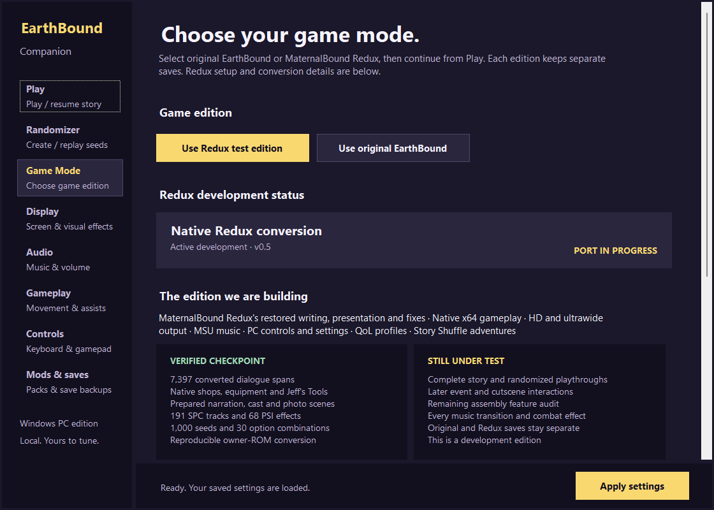

*Actual dev.19 launcher capture. Gameplay and historical screenshots below retain their stated checkpoint.*

The target is one polished PC edition: MaternalBound Redux's restored writing, art, fixes, and presentation running through the native engine alongside Companion's display, audio, input, save, QoL, mod, and randomizer features. Story Shuffle v3 binds every seed to the exact selected game version, asset hash, progression policy, and save namespace. Both the original and the pinned Redux packs have content-specific protection policies; unknown packs cannot be randomized.

> [!IMPORTANT]
> This project does **not** contain an EarthBound ROM, extracted Nintendo assets, soundtrack audio or saves. The documentation includes clearly labeled development screenshots. You must provide your own legally obtained clean **EarthBound (USA)** ROM. Companion verifies it and builds the required native data locally. We do not condone piracy.

[Developer testing tools](docs/TESTING.md) · [Latest tester release](https://github.com/rages4calm/earthbound-companion/releases/tag/v0.5.0-redux-dev.31) · [MaternalBound native port status](MATERNALBOUND-NATIVE.md) · [Randomizer rules](RANDOMIZER.md) · [Research and compatibility](RESEARCH.md) · [Credits](CREDITS.md) · [Source lineage](UPSTREAM.md)

Development includes reported playtesting issues and the explicitly resumed source audit. The current fixes cover the completed user-reported campaign, including the museum quest, Sound Stone/Magicant presentation, Giygas artwork, credits and widescreen PSI. Historical fixes and their original verification scope are retained in the [changelog](CHANGELOG.md) and [release evidence](docs/RELEASE-dev30.md). Untested natural story branches, full randomized progression, all combat combinations and broader physical audio/display/controller coverage remain open.

## Companion at a glance

These are real captures from the ROM-free dev.8 development launcher before game-data setup. They contain no extracted game artwork or gameplay screenshots.

<table>
  <tr>
    <td width="50%">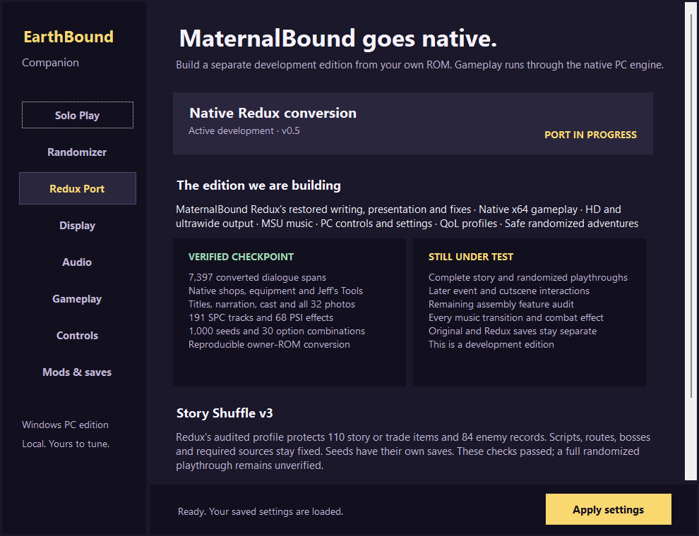</td>
    <td width="50%">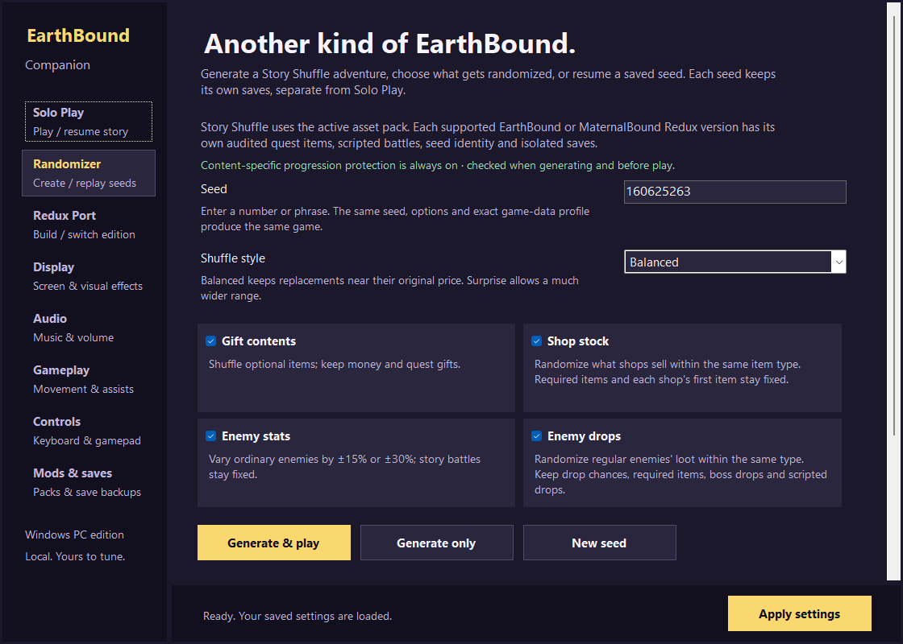</td>
  </tr>
  <tr>
    <td align="center"><strong>MaternalBound Redux native-port status</strong></td>
    <td align="center"><strong>Story Shuffle v3 content-safe randomizer</strong></td>
  </tr>
  <tr>
    <td width="50%">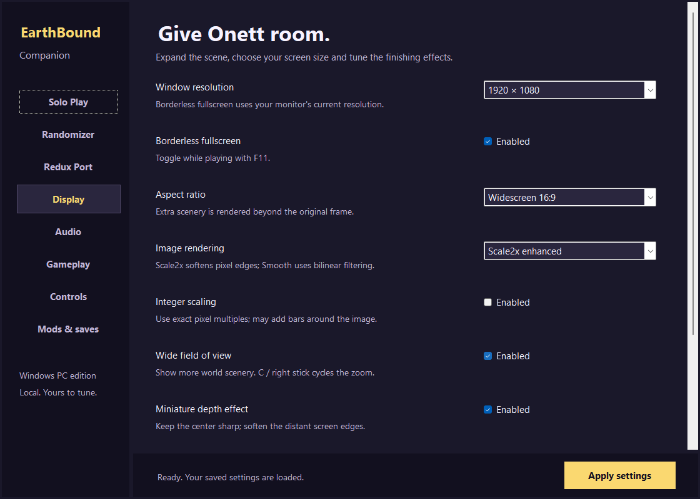</td>
    <td width="50%">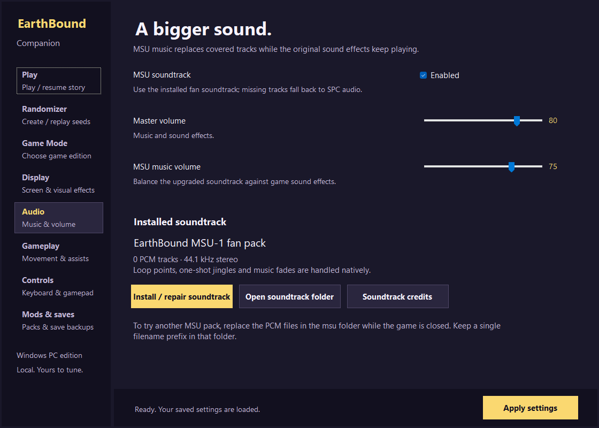</td>
  </tr>
  <tr>
    <td align="center"><strong>HD, widescreen and rendering controls</strong></td>
    <td align="center"><strong>Native MSU audio setup</strong></td>
  </tr>
  <tr>
    <td width="50%">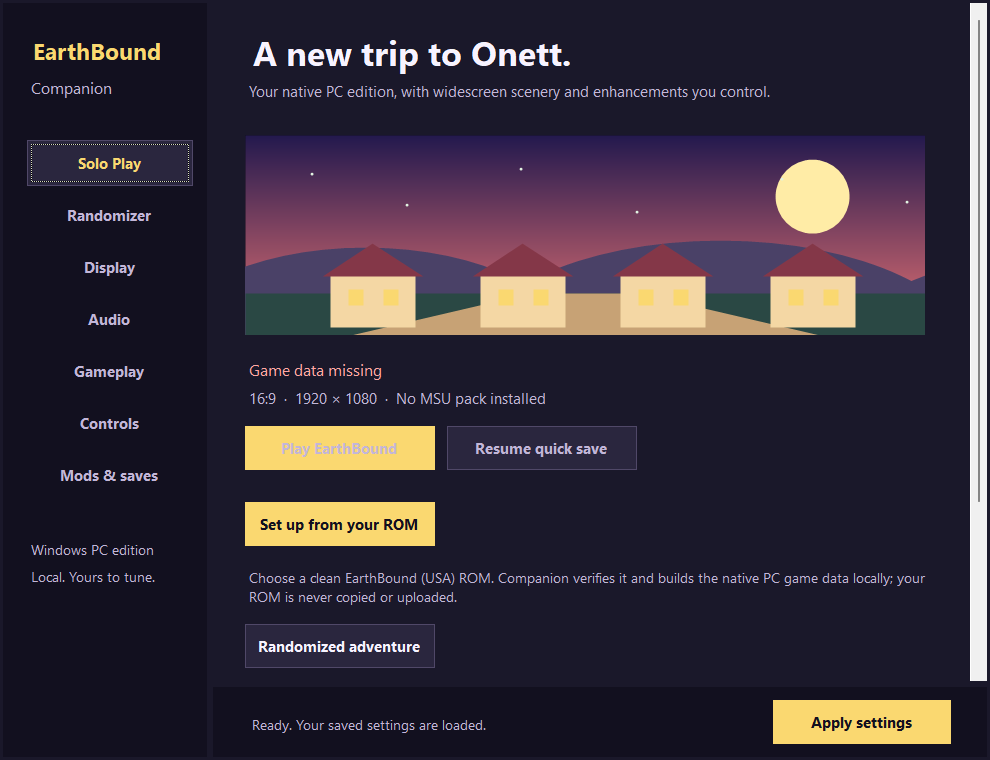</td>
    <td width="50%">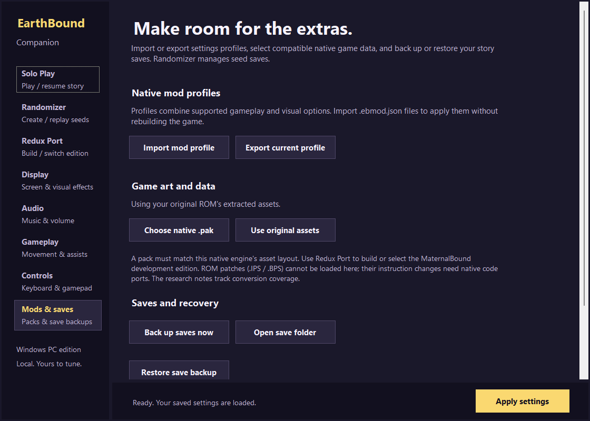</td>
  </tr>
  <tr>
    <td align="center"><strong>Guided ROM setup and Play</strong></td>
    <td align="center"><strong>Native profiles, asset packs and save recovery</strong></td>
  </tr>
</table>

The [Redux port page](MATERNALBOUND-NATIVE.md#development-captures) also shows actual native gameplay, Tools, equipment and cast renders. Recorded opening replays pass normal-button walking through the house, doors and stairs, Mom's dialogue, the clothes-change event and initial outdoor movement, with fresh-process restores between checkpoints. Those recorded replays cover both Redux story and a generated seed; their evidence retains the tested binary hashes.

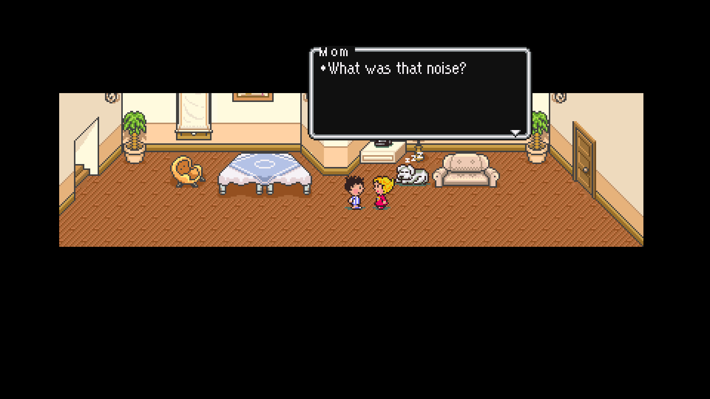

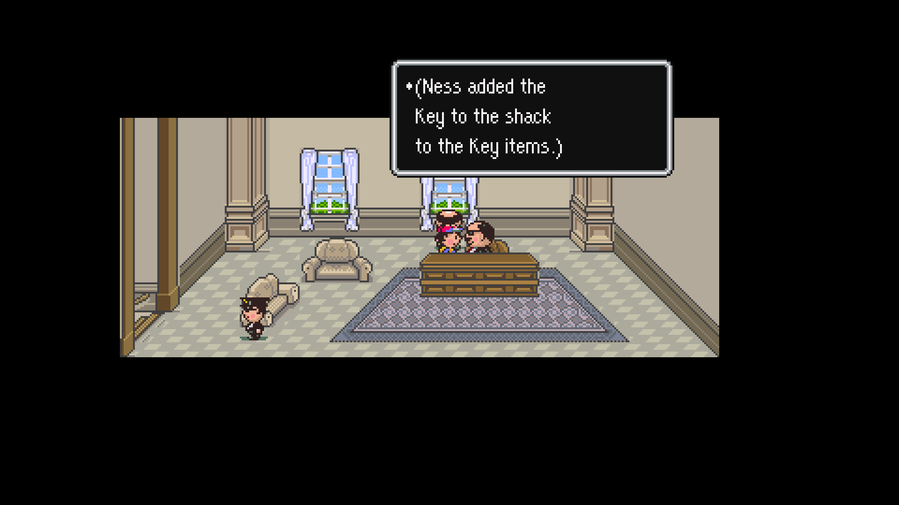

This capture replays the mayor’s actual Shack Key award using the production engine and ordinary recorded inputs. It is a story checkpoint, not a completed playthrough.

This 1080p capture uses locally supplied game data. It documents the development build; it is not proof of complete story compatibility.

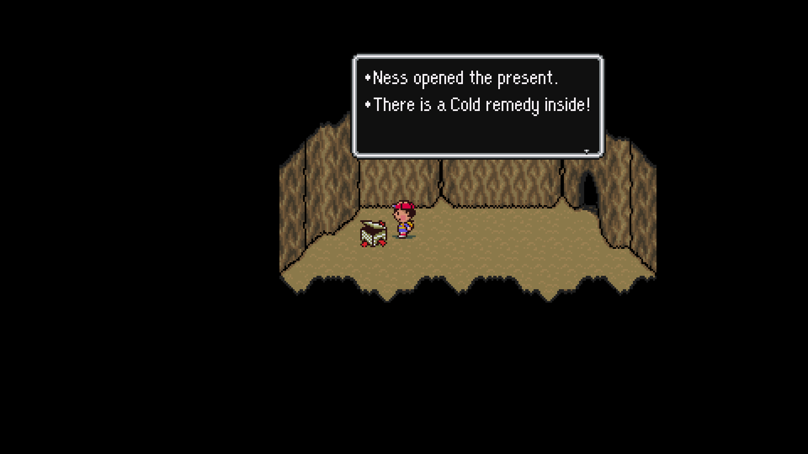

This production-engine capture shows the real present reward after the dev.5 fix. Testing also checks inventory, the opened flag and repeat protection.

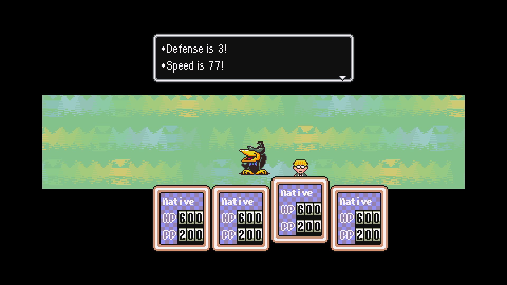

This unedited production-engine capture restores the added Speed message from the prepared four-member battle fixture. The debug character names and stats are fixture inputs; this is not ordinary story progress.

## What this is

EarthBound Companion packages a native x64 C/SDL2 game build with a self-contained Windows settings application. Gameplay executes as compiled native code; the optional SNES main-CPU verification emulator is disabled. Software implementations of the original graphics and SPC/DSP audio subsystems remain for rendering and sound.

The player-facing setup separates code/tools from player-supplied game data. Setup reads the owner's ROM locally and never modifies or uploads it. Conversion creates local working data and generated ROMs, removed after successful setup. Failed builds can retain private diagnostics and working files; those folders must not be uploaded.

**We still use the upstream native engine. This is an adaptation of that foundation, not a ground-up replacement.** The source lineage is [Herringway/ebsrc](https://github.com/Herringway/ebsrc) → [BrianPugh/earthbound](https://github.com/BrianPugh/earthbound) → [seanstaggsQU/earthboundRecompLinux2026](https://github.com/seanstaggsQU/earthboundRecompLinux2026) → Companion's pinned patch. Our launcher, Redux converters/adapters, PC integration, fixes, randomizer and recovery build on that work. Adding these features does not erase upstream authorship or licensing obligations. [Verified provenance](UPSTREAM.md) · [Full credits](CREDITS.md).

## Quick start

1. Download the Redux development package from [Releases](https://github.com/rages4calm/earthbound-companion/releases) for experimental MaternalBound testing, or v0.4.0 for the older original-story preview.
2. Extract the complete ZIP to a normal folder.
3. Run **EarthBound Companion.exe**.
4. Select your clean EarthBound (USA) `.sfc` or `.smc` ROM.
5. Leave **Install the complete MSU soundtrack** checked for enhanced music, or clear it to use SPC music. Internet access is needed for the pinned source and soundtrack downloads; testers need no Python, Git, .NET installation or compiler.
6. When setup finishes, choose **Play EarthBound**. The Redux package identifies itself as a development profile. **Game Mode → Use original EarthBound** returns to the original story without changing either edition's saves.

The application accepts the clean 3 MiB USA ROM, with or without a 512-byte copier header. A different revision or modified ROM is rejected before extraction.

Before updating, close the game and launcher and back up the existing installation. Preserve `Profiles`, `UserData` and `msu`; review the target release notes before reusing development quick saves. Older content packs have specific upgrade/import routes described in [the conversion notes](MATERNALBOUND-NATIVE.md).

Switching editions selects a separate adventure; it does not convert an existing playthrough. Normal phone saves are the migration path between engine builds. Development quick saves require a compatible engine and state format.

## Where to go in the launcher

| Tab | Use it for |
|---|---|
| Play | Start or resume the normal story in the selected edition; choose a presentation/convenience preset. |
| Randomizer | Choose shuffle options, generate and replay seeds, open spoiler logs and manage each seed's separate saves. |
| Game Mode | Choose Original or Redux, choose the title screen, build game data or review conversion coverage. |
| Display | Resolution, fullscreen, widescreen framing, pixel filtering and visual effects. |
| Audio | MSU soundtrack selection/installation, music and game volume, and soundtrack credits. |
| Gameplay | Sprint, quick dialogue, homesickness/call settings, battle rewards and quick-save bank. |
| Controls | Keyboard/controller bindings, stick deadzone and face-button labels. |
| Mods & saves | Settings profiles, compatible native asset packs, and story-save backup/restore. |

Click **Apply settings** to save option changes. Game Mode selects the story edition played from Play. Randomizer's seed library manages randomized adventures and their saves.

## PC presentation notes

**HD means high-resolution output and enhanced presentation.** Converted pixel artwork is used; a replacement hand-drawn HD art pack is not included. Widescreen expands the native world view within the renderer's limits, rather than merely stretching the original picture. Physical controller play and every display/DPI combination have not been fully verified. Mod profiles tune supported native options; arbitrary ROM patches require explicit native adaptations.

## Native MSU soundtrack

First-run setup can download all 164 PCM tracks from [ShadowOne333’s EarthBound MSU-1 pack](https://archive.org/details/earthbound-msu-1-pack). Each file is checked against the embedded size and checksum manifest before it is installed. Interrupted setup keeps completed tracks; **Audio → Install / repair soundtrack** resumes and verifies the collection. Missing or invalid files fall back to the selected edition's SPC soundtrack. Native checks cover all 164 PCM loop/end boundaries, the eight Sound Stone transitions and retained SPC sound effects; complete listening and story-transition coverage remain unverified.

The PCM files are not stored in this repository or the release ZIP. See [CREDITS.md](CREDITS.md) for provenance.

## Story Shuffle v3

Companion includes its own native randomizer for replayable adventures:

- **Gift contents:** eligible optional gifts change within their item category; protected quest/trade sources stay fixed.
- **Shop stock:** eligible optional stock changes within its type; protected items, each shop's first slot and empty/ineligible slots stay fixed. Item prices are unchanged.
- **Enemy stats:** ordinary-enemy HP, offense, defense and speed vary within bounded ranges; bosses and scripted enemies stay fixed.
- **Enemy drops:** eligible ordinary-enemy loot changes within its type. Drop chances, empty drops and protected/boss/scripted drops stay fixed.
- Balanced and Surprise modes;
- deterministic seed recipes;
- isolated saves, screenshots and recovery backups for every seed.

The generator keeps 78 identified quest/trade items and their original sources fixed, preserves 52 scripted-battle records, and leaves maps, doors, routes, scripts, bosses, prices and starting items unchanged. Independent guards run at generation and before launch. Version 3 also isolates game editions: content ID, exact asset hash, safety policy, seed identity, and save folder must agree. This protects the audited original-story dependencies; it is not proof of every possible full playthrough.

The pinned Redux profile separately protects 110 items and 84 enemy records. Its audit covers 64,360 decoded operations, scripted encounter groups and the expanded 69-shop table. Independent generation checks pass across 1,000 seeds and all 30 option combinations for each edition. The Redux enemy-AI footer, routes, scripts and protected sources remain intact. This is conservative story preservation, not a randomized-world logic solver or proof of every playthrough.

This generator is inspired by the EarthBound randomizer community but does not claim seed parity with [earthbound.app](https://earthbound.app/) or [stochaztic/eb-randomizer](https://github.com/stochaztic/eb-randomizer). Ancient Cave, Open mode and Keysanity are not implemented. See [RANDOMIZER.md](RANDOMIZER.md).

## Current boundaries

- One user-reported Redux campaign reached Giygas and credits, with equipment/stat boosts for final testing. An automated or unboosted full campaign and full randomized progression are not certified.
- [MaternalBound Redux](https://github.com/ShadowOne333/MaternalBound-Redux) is being adapted from a pinned active-source snapshot, rather than the official v1.1 BPS release. The checkpoint converts 7,397 dialogue spans, implements 17 routine adapters, passes 81 VM command checks and 48,640 AI-selector turns, and resolves all 898 movement-script roots. Title scenes, 191 SPC tracks, 68 PSI effects, native shops/equipment, all 11 battle Tools and all 32 photo-credit branches have bounded checks. Untested natural story branches, all combat-effect combinations and complete music-transition coverage remain unverified. See the [detailed coverage](MATERNALBOUND-NATIVE.md).
- Arbitrary IPS, BPS and EBP patches cannot be loaded as native mods; their game-code changes require explicit ports.
- The release is a Windows x64 development test build. Bug reports should include the active edition or seed session's `game.log` and a normal phone save when possible.

## Source layout

| Path | Purpose |
|---|---|
| `Companion/` | .NET 8 Windows Forms launcher, settings, setup, backups and Story Shuffle source |
| `patches/native-companion.patch` | Exact native-engine changes against the pinned upstream commit |
| `scripts/Bootstrap-Native.ps1` | Fetches the upstream source and applies that patch |
| `scripts/` | Asset registry, progression audit, MSU verification and package-audit tools |
| `Mods/` | ROM-free example `.ebmod.json` profiles |
| `Licenses/` | Notices shipped with used dependencies |
| `validation/` | Bounded build, package and gameplay evidence |

## Building from source

The repository records the native foundation as a pin and patch rather than vendoring its entire tree. Bootstrap fetches the exact revision used by the release:

```powershell
git clone https://github.com/rages4calm/earthbound-companion.git
cd earthbound-companion
powershell -ExecutionPolicy Bypass -File .\scripts\Bootstrap-Native.ps1
```

Developers need a Windows x64 C toolchain, CMake/Ninja, SDL2 development files, Python and the .NET 8 SDK. Runtime builds use `EB_RUNTIME_ASSETS=ON`, `EB_ENABLE_VERIFY=OFF` and `EB_ENABLE_AUDIO=ON`. The native executable compiles without a ROM, extracted JSON or `ebtools`: numeric constants come from the checked-in assembly enums using Python 3.9+ standard-library code. Game setup still requires your own ROM to produce playable data. [Fresh dev.31 public-source build](validation/public-clean-source-dev31.json) · [Constants and loader proof](research/runtime-constants-final-manifest-dev16-v9.json). Redux setup-helper builds additionally require the pinned CoilSnake/CCScript toolchain and PyInstaller; see [the conversion instructions](MATERNALBOUND-NATIVE.md#reproducing-development-conversion).

For a code-only build after installing your toolchain, configure `native-source/port/unix` with the runtime flags above and your `SDL2_DIR`, then run `cmake --build` on that build directory. The loader fixture is deliberately excluded from the default build. For its separate test, install `ebtools`, run `python scripts/create_fixture.py`, then build the explicit `test_runtime_assets` target and execute it with the generated fixture pack and scratch paths. `Verify.ps1` records that sequence. It uses synthetic test data, not game JSON.

The checked-in rebuild/package scripts record the current workspace's tool paths; they are not a one-command provisioner for a fresh machine. Some historical commands refer to local `tools/` files, while published scripts live in `scripts/`. Put your own ROM at `ROM\EarthBound (USA).sfc`; `ROM/` is ignored by Git. Generated game data, build outputs, soundtracks, saves and runtime screenshots remain untracked; the labeled documentation screenshots are checked in.

## Legal and project status

EarthBound and Mother 2 are trademarks and copyrighted works of their respective owners. This is an unofficial fan project, not affiliated with or endorsed by Nintendo, Shigesato Itoi, APE, HAL Laboratory, or any rights holder. No ownership of the original game is claimed.

The October 4 review found no repository-wide redistribution grant in the reviewed native-foundation README/license files; GitHub also detects no top-level license. Third-party library licenses cover those libraries, not the whole engine. Public visibility and credits do not supply missing permission. [Review record](validation/upstream-license-provenance.json) · [GitHub's licensing guidance](https://docs.github.com/en/repositories/managing-your-repositorys-settings-and-features/customizing-your-repository/licensing-a-repository).

MaternalBound Redux and its adaptations have separate GPLv3 terms. Those terms do not license the native foundation. The combined engine's distribution and GPL compatibility remain unresolved in the recorded review despite the public development releases; repository visibility does not settle either issue. Original Companion files have their own [limited-scope license](LICENSE.md). A patch or compiled executable can still contain upstream material even when the full source tree is not vendored. See [LEGAL.md](LEGAL.md) and [CREDITS.md](CREDITS.md). No disclaimer claims to grant game rights or guarantee legal protection.

## Verification

The v0.4.0 package passed clean-ZIP first-run extraction, exact asset-pack comparison, Companion self-tests, seed safety validation, and all 164 installed MSU checks. The archive was scanned and contained zero ROM, `.pak`, PCM, save, state or screenshot files. The Redux development ZIP also passed clean setup from a headered USA ROM with no Python on PATH, a real corrupt-track download/repair and verification of all 164 MSU files, exact original/Redux pack reproduction, native story and randomized openings, and profile save-isolation checks. Story Shuffle v3 passes 1,000 seeds and all 30 option combinations for each edition. Exact hashes and coverage limits are in [validation/](validation/).

Issues and contributions should never attach ROMs, extracted asset packs, saves containing embedded game data, or soundtrack files. Documentation captures are labeled with their tested development scope.
