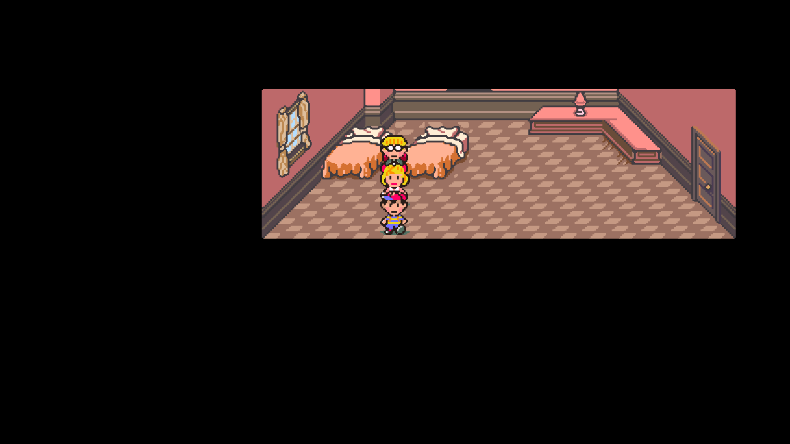

# Native audit checkpoint: dev.16

This continues the [dev.15 audit](NATIVE-AUDIT-dev15.md) against pinned MaternalBound Redux `897d00833f4a08a0a92f106abf631629a6a6a041`. The audit remains active. A complete story/randomizer playthrough, every action branch and full audiovisual parity are unverified.

## Confirmed corrections

- **Redux bulk-buy capacity:** ShopSys reserves each ordinary slot with unused item 203. The host Key Items pool previously absorbed those placeholders, allowing a purchase to charge for more than it delivered. Redux now treats this placeholder as an ordinary inventory item; source capacity abort/refund logic is restored. Real packed-menu transactions and fresh-process continuations verify the correction.

- **Direction and encounter advantage:** fine direction now reproduces the source lookup, wrapped coordinates, normalization and hardware-division boundaries. The previous continuous-angle approximation could choose a different facing at ordinary distances. Both game modes match their actual ROM in complete direction calls and real contact-to-swirl-entry comparisons, including Redux's Jeff/Poo leader selection.
- **Sprite-script return and frame selection:** render entry points now return the advanced VRAM destination consumed by movement-script branching. The distinct C0A4A8 alias also uses temporary frame zero while retaining the actor's saved animation field. This prevents a completed child animation from falling into the neighboring movement script; the affected complete parent/child event and cold continuation pass.
- **Loaded item timers:** successful Continue and new-game finalization now initialize transforming items as the source does. Eggs, chicks and chickens retain ordinary inventory behavior. The host Key Items pool no longer absorbs transforming chicks/chickens. Existing pooled copies return to active party bags with free space; full bags preserve them until room is available. Phone/F6 recovery and modal/battle guards are tested. Save format and content identities remain unchanged.

- **Boss transformation cleanup:** the KO continuation now honors the source's skip-death-text-and-cleanup flag before both death text and cleanup. Carbon Dog's actual final action transforms it into Diamond Dog and preserves the second form's HP/status; the prior continuation incorrectly cleared the new form. The shared source branch also applies in Original mode.

- **Bomb splash targets:** Bomb and Super Bomb now skip empty party slots and NPC member 5 on the right of a target, matching the source's IDs 1–4. The previous guard entered splash damage for an ordinary trailing empty slot and consumed two extra serialized RNG bytes. Both game modes use the corrected guard.

- **Saved random rolls:** text command `CC 1D 21`, timed-item initialization/resets, level-growth rolls, homesickness, delivery placeholders, enemy placement and teleport angle use the serialized game generator at their source call sites. This preserves the source's distinct modulus, bit-mask and scaled-probability formulas. F6 restoration is tested; the complete phone-save RNG timeline is not certified.
- **Encounter probability:** normal enemy spawning uses the high byte of `random_byte * 100`, rather than `random_byte % 100`. Complete original-machine execution checks all 256 inputs; the previous formula disagreed on 253. Butterfly spawning retains its separate source formula. Prepared spawning tests exercise real consumers with declared terrain controls; they do not verify every map's collision or spawn timeline.
- **Follower sprite spacing:** Original mode retains the aligned-spacing guards. Redux mode follows its active diagonal spacing patch and two-pixel threshold. Separate comparisons against each mode's actual ROM correct both prepared screen cases and ordinary copied-save walking/running traces. Absolute coordinates and collision are unaffected; this visual correction does not explain earlier stair/hotel collision blockers.
- **Original possession script:** extraction now includes the previously missing mini-ghost event from the owner's clean ROM. Existing asset IDs and script-bank indices remain stable. Loading an older Original F6 state repairs only the recognized mini-ghost actor with the unresolved script marker; immediate game state, party records and event flags remain byte-identical. Valid scripts, unrelated actors, Redux states and legacy packs without the new script are excluded from this repair.

Redux assets, content/seed namespaces and format-16 saves are unchanged. Original mode has an updated pack and requires the clean ROM to rebuild old data through setup. The owner installation is updated separately after package verification. Older Original seeds retain their own packs; regenerate them to obtain the possession-script fix. Legacy raw movement data remains readable, but does not acquire the missing script automatically.

The Original progression policy is re-derived from 61 script blocks/61,972 decoded operations: its 78 protected items and 52 scripted-battle enemies are unchanged. The registry accepts the two exact audited Original hashes. New seeds retain the actual base hash in their identity; old seeds are not silently relabeled. Keep the earlier installation to resume an older Original seed, or generate a new adventure for the updated data.

The launcher's recovery registry now matches the engine's actual save format 16; its previous Original entry still named format 12. A real copied format-16 checkpoint is backed up, damaged privately, restored byte-for-byte and loaded by the packaged native engine. A private obsolete-format copy is refused without changing the destination. The owner's saves are never mutated by this test.

## Evidence

| Area | Report | Scope |
|---|---|---|
| Text/timer/level RNG consumers | [Before](../research/rng-consumers-dev16-v6-red.json), [corrected v9](../research/rng-consumers-dev16-v9-green.json) | 1,936 warm and seven fresh-process cold cases per mode; real production consumers, prepared entry stages |
| Overworld RNG consumers | [Reviewed before](../research/overworld-rng-dev16-v1-reviewed-red.json), [corrected v9](../research/overworld-rng-dev16-v9-green.json) | 5,216 warm and eight cold cases per mode. Earlier comparison uses nonzero ranges; final controls additionally cover a zero-width prepared range |
| Original arithmetic execution | [RAND_MOD](../research/native-rand-mod-dev16.json), [spawn probability](../research/native-spawn-probability-dev16.json) | 5,888 complete modulus calls and all 256 spawn inputs, with source-byte, CPU/RAM and call-order checks |
| Mode-specific follower callback | [Redux intermediate regression](../research/native-redux-party-screen-dev16-v1-red.json), [dual-mode final v4](../research/native-party-screen-dual-dev16-v4-final-green.json) | 5,816 contexts per mode compared to that mode's actual ROM; Original comparison alone does not certify Redux |
| Ordinary Redux follower movement | [Before](../research/native-redux-party-run-dev16-v1-red.json), [final v4](../research/native-redux-party-run-dev16-v4-final-green.json) | 6,992 live callback states from ordinary copied-save walking/running routes |
| Dissolve tile selection | [Before](../research/native-tile-merge-dev16-v1-red.json), [final v4](../research/native-tile-merge-dev16-v4-final-green.json) | 1,536 cases per mode, source-derived serialized RNG consumption |
| Placement helpers | [Frozen v3 comparison](../research/native-enemy-placement-helpers-dev16-v3.json) | 42,912 cases per mode: all 20,480 map cells, unsigned boundary controls and all 231 enemy records. Complete spawn/path/collision behavior excluded |
| Original pack and ghost runtime | [Pack](../research/original-movement-pack-review.json), [runtime/recovery](../research/original-event-interpreter-ghost-v5-review.json) | 26 runtime cases/224 assertions; original bank IDs and old F6 recovery. Root scans cover 894 Original/898 Redux roots structurally, not every script branch |
| Interpreter operands | [Bounded operand audit](../research/event-interpreter-operand-review.json) | 6,398 active operand sites across both packs; structural evidence, zero executed runtime cases |
| Level-growth boundary review | [Machine comparison](../research/native-stat-growth-dev16-red.json), [reachability](../research/native-stat-growth-reachability-dev16.json) | 462,237 original calls; base stats 2–255 match. Synthetic bases 0/1 differ; normal story reachability is unestablished and no speculative formula change is applied |
| Battle evidence inventory | [Current ledger](../research/battle-semantic-coverage-dev16-final.json) | Selected evidence for all 144 active callbacks. Twelve source-empty callbacks are separately verified. This is not a branch/encounter completion percentage |
| Battle additions | [Thunder](../research/redux-battle-thunder-coverage-dev16-v1.json), [Flash](../research/redux-battle-flash-coverage-dev16-v1.json), [Steal](../research/redux-battle-steal-coverage-dev16-v1.json), [offensive items](../research/redux-battle-offensive-items-coverage-dev16-v1.json), [party effects](../research/redux-battle-party-effects-coverage-dev16-v1.json), [stats/drain](../research/redux-battle-stat-drain-coverage-dev16-v4.json), [physical status](../research/redux-battle-physical-status-coverage-dev16-v4.json) | Matching Original reports accompany each Redux report. Real dispatch/children and selected source controls; complete turns and natural boss/story progression excluded |
| Final battle additions | [Bomb before](../research/redux-battle-bomb-coverage-dev16-v4-red.json), [Bomb corrected](../research/redux-battle-bomb-coverage-dev16-v5.json), [equipment](../research/redux-battle-equipment-coverage-dev16-v5.json), [transformation/drain](../research/redux-battle-transform-drain-coverage-dev16-v5.json), [Prayer/time freeze](../research/redux-battle-prayer-freeze-coverage-dev16-v5.json) | All eight remaining callback entries; matching Original reports. Complete real native child continuations in prepared contexts. Bounded original/pinned bomb adjacency oracle stubs its children; full native variance/damage consumes actual RNG |
| Original policy upgrade | [Source decode](../research/original-progression-source-audit-dev16.json), [unchanged protections](../research/original-progression-upgrade-dev16.json), [1,000 new-pack seeds](../validation/randomizer-dev16-new-original.json), [1,000 legacy seeds](../validation/randomizer-dev16-legacy-original.json), [1,000 Redux seeds](../validation/randomizer-dev16-redux.json) | Exact audited pack hashes, all 30 option/preset combinations each, protected-byte and rejected-mutation checks; no complete randomized playthrough |
| Actual checkpoint recovery | [Copied save/native load](../validation/actual-checkpoint-recovery-dev16.json) | Exact format-16 bytes restored, obsolete format-12 rejected, native engine resume and immutable inputs; no user save writes |
| Complete prayer cinematics | [Redux v9](../research/redux-prayer-complete-dev16-v9.json), [Original v9](../research/original-prayer-complete-dev16-v9.json) | All seven callbacks from pc0 through actual text/map/entity children and source entry prerequisites; preceding quest/Pray selection and exact pixels/audio/timing excluded |
| Ending transactions | [Redux, zero photos](../research/redux-ending-0-complete-dev16-v9.json), [Redux, 32 photos](../research/redux-ending-1-complete-dev16-v9.json), [Original, zero](../research/original-ending-0-complete-dev16-v9.json), [Original, 32](../research/original-ending-1-complete-dev16-v9.json) | Actual Mom Yes → cast → credits → postcredits, zero/all-photo controls. Natural photo acquisition excluded |
| Final letter | [Redux v9](../research/redux-letter-complete-dev16-v9.json), [Original v9](../research/original-letter-complete-dev16-v9.json) | Complete ending then actual final letter; downstairs arrival is prepared. THE END is an intentional terminal wait; displayed art matches independently decompressed pack data |
| Required regressions | [Subsystems](../validation/native-subsystems-dev16.json), [owner hotel exit](../validation/hotel-owner-dev16.json), [hotel transaction](../validation/hotel-transactions-dev16.json), [Jeff repair](../validation/jeff-repair-dev16.json) | Real copied-save movement, full prepared dialogue transactions and player/observer agreement. Agreement alone is not an independent oracle |
| Overlay/palette/elevator | [Native v5 behavior](../research/redux-overlay-palette-behavior-dev16-v5-review.json), [independent tint execution](../research/redux-palette-tint-machine-dev16-v5-review.json) | 890 native cases/4,412 assertions, dry/shallow/deep queue/OAM/raster controls and full elevator actors; 298 complete Original/Redux machine tint calls and 38,144 color comparisons. Entry states are prepared; natural map/story traversal and complete audiovisual parity excluded |
| Boss KO/final action | [Before](../research/redux-battle-ko-lifecycle-dev17-v5-red.json), [corrected v6](../research/redux-battle-ko-lifecycle-dev17-v6.json), [actual-machine branch](../research/redux-battle-ko-skip-machine-dev17.json) | 64 full native KO cases per mode: Frank controls and Carbon Dog's real transformation action; four complete branch/epilogue controls per ROM. Corresponding Original reports retain their own identities. Full original-machine KO and natural story acquisition excluded |
| Contact/Dad call lifecycle | [Frozen v5 comparison](../research/redux-contact-phone-hook-dev16-v5-final.json) | Per mode: 288 contact, 112 Dad queue and 60 timer cases against complete source CPU routines; seven cold entries and player/observer full Yes/No dialogue, fade, queue drain and rearm. Later direction/advantage, natural two-hour waiting and audible bell/music excluded |
| Complete prepared encounters | [Redux v9](../research/redux-battle-full-encounters-dev18-v9.json), [Original v9](../research/original-battle-full-encounters-dev18-v9.json), [final v9 manifest](../research/shop-audit-dev18-final-manifest.json) | 72 encounters per mode through real platform-input menus/turns and cleanup: seven source groups, eight seeds and guarded/special controls. Victory, Clumsy Robot special teleport and legitimate reflected-damage defeats are checked separately. Source-backed native expectations; full independent machine encounter and natural quest acquisition excluded |
| Timed items after Continue | [Before](../research/timed-item-dev16-v6-red.json), [warm v9](../research/timed-item-dev16-v9-green.json), [cold v9](../research/timed-item-cold-dev16-v9.json) | Real private phone saves, Continue finalization and 6,000 leader ticks: two warm timelines plus 32 cases in 64 fresh processes across all four PCs/three items/empty controls. Transition guards and exact source-ordered transformation frames; title-menu input and natural acquisition excluded |
| Fine direction and encounter advantage | [Direction before](../research/native-direction-approach-dev17-red.json), [direction v8](../research/native-direction-approach-dev16-v8-final.json), [encounter before](../research/native-encounter-initiative-dev16-v6-red.json), [encounter v8](../research/native-encounter-initiative-dev16-v8-final.json) | 115,200 complete CPU direction/division cases per mode and 100 actual contact → encounter → swirl-entry prefixes per mode. Jeff/Poo selection and source initiative match; later swirl/battle/pathfinding and natural contact-route traversal excluded |
| Render return and active frame-zero alias | [Complete machine renderer](../research/snes-sprite-render-live-abi-dev16-review.json), [active ENTRY3 machine alias](../research/snes-sprite-entry3-live-abi-dev16-review.json), [native v8 returns/VRAM](../research/native-sprite-render-live-abi-dev16-v8-review.json), [active ENTRY3 v8](../research/native-sprite-entry3-live-abi-dev16-v8-review.json) | 1,160 complete source-machine calls and 1,188 native matrix cases. Persistent fields, transient frame zero and invalid-data guards; all 884 first-matrix VRAM uploads unchanged. Full story/presentation and other direct-page visibility contexts excluded |
| Complete WRAM-consuming events | [Warm/cold v8](../research/event-wram-consumer-dev16-v8-review.json), [frozen bundle and old-state limitation](../research/presentation-wram-dev16-v8-evidence-manifest-final.json) | 24 cases/154 assertions, nine retained roots per mode and six fresh-process continuations. EVENT670 child animation finishes at its source endpoint. An older private save already in the wrong neighboring script is not automatically rewound; its prior side effect cannot be undone generically |
| Transforming items and game-over | [Redux pool v9](../research/redux-inventory-transform-pool-dev18-v9.json), [Original pool v9](../research/original-inventory-transform-pool-dev18-v9.json), [Redux game-over v9](../research/redux-inventory-gameover-dev18-v9.json), [Original game-over v9](../research/original-inventory-gameover-dev18-v9.json), [frozen v9 manifest](../research/shop-audit-dev18-final-manifest.json) | 177 pool/lifecycle cases and 16 real game-over branches per mode. All 256 byte-ID classifications and 69 Redux/66 Original shop-stock mappings; real phone/F6 loads, quantities, duplicates, free/full active bags and guarded retry. Stock mapping is structural; full shop transactions and natural progression excluded |
| Special movement and timers | [Frozen v8 integration](../research/redux-special-movement-integration-dev16-v8-review.json) | 152 real small-sector/normal map loads, sprite selector/timer boundaries and five fresh-process continuations; 18,400 complete pinned-machine timer pairs. Prepared map/actor prerequisites; natural stairs/doors/rope/quest traversal and audible footsteps excluded |
| Wider Redux source accounting | [Pinned crosswalk](../research/redux-wider-source-accounting-dev16-v8.json) | Reuses the 191-source/105-excluded-span ledger and accounts for 149 sources outside the prior named-hook scope. Structural decisions and existing evidence links; no new opcode/write inventory or full module parity claim |
| ROM-free source compilation | [Full v9 public patch](../validation/public-clean-source-dev16.json), [build/constants manifest](../research/runtime-constants-final-manifest-dev16-v9.json), [published script guards](../validation/published-build-scripts-dev16.json) | Fresh exact native-base and tamp archives plus the complete published patch; default compilation without game JSON, eight actual player self-tests across both local packs. Separate 446-ID/name, malformed-input, legacy-encoding, struct-info and real synthetic-loader checks; asset-dependent OFF build and fresh-machine dependency provisioning excluded |
| Complete selected shop transactions | [Before and fix](../research/shop-audit-dev18-final-evidence.md), [Redux v9](../research/redux-shop-transactions-dev18-v9-buffered.json), [Original controls](../research/original-shop-transactions-dev18-v9-buffered.json), [frozen manifest](../research/shop-audit-dev18-final-manifest.json) | 74 Redux/nine Original actual packed transactions; 17 fresh-process quantity/store continuations. Capacity, cash/refunds, 56-slot/99-item limits, stock guards, buy/equip/sell/cancel/retry and Moonside reversed choices. 83 inventory-vector checks overlap those executions. Source caller prerequisites are prepared; natural NPC reachability, every serialized phase, service/barter shops, pixels and audible delivery excluded |
| Complete selected story parents | [Strict frozen v8 proof](../research/redux-story-cutscene-parent-dev16-v8-cold-final-review.json), [identity and limits](../research/story-cutscene-parent-dev16-v8-evidence-manifest-final.json) | 36 cases/638 assertions and 12 immediate post-bootstrap fresh-process restores. Full Bubble Gum rope/camera, Dr. Andonuts → actual EVENT137 → Sky Walker flight/Jeff joining, three ghost stages and four-zombie hotel capture/basement. Entry prerequisites are source-derived; connecting quest/door traversal and full pixels/audio/timing parity excluded |
| Tools and selected OneItem shop entries | [Frozen v9 extension](../research/shop-special-dev19-evidence.md), [manifest](../research/shop-special-dev19-final-manifest.json) | 21 Redux/nine Original transactions and seven fresh-process continuations. First Bazooka ownership/stock change, Tools-off ordinary inventory, selected OneItem vendor and ordinary Broken Iron controls. 30 bag postchecks overlap these transactions; more vendors, service/barter branches and natural NPC traversal remain separate |
| Active Redux hook evidence | [Updated notes](../research/redux-active-bugfix-review-dev16.json), [earlier completeness review](../research/redux-active-hook-evidence-completeness-dev16.json), [v8 behavioral gap refresh](../research/redux-hook-semantic-gaps-dev16-v8.json) | 36 active hooks and existing 105-span assembly ledger; source adapters exist, with explicit remaining behavioral gaps |

Reports preserve the build, source, library, tool and pack identities actually executed. Earlier frozen v3/v5/v6/v7 and dev.16 v1 evidence is retained under its own identity; it is not relabeled as final v9 execution. Counts overlap and must not be added into a conversion percentage.

Developer tools are under `scripts/`; [testing instructions](TESTING.md) describe isolated sessions and reproduction. Original-machine tests take explicit local ROM/reference-tool paths and write private scratch data. No ROM, game asset pack, soundtrack, personal save or reference emulator belongs in the player ZIP. The [Retro Porting Toolkit comparison guide](https://retroportingtoolkit.com/docs) is a useful workflow reference; this project still needs EarthBound-specific contracts and independent oracles.

## Current gameplay capture

This unchanged 1280×720 frame comes from the copied owner-save regression on final v9. The player walks from (7496, 9432) to (7496, 9463) with ordinary Down; no relocation or save repair. [Capture identity and lossless encoding](../validation/hotel-exit-capture-dev16.json). Full story coverage remains separate.

## Remaining work

Continue untested battle branches and groups, untested shop/service/barter transactions and natural NPC callers, and water-overlay/palette/elevator story contexts. Solo Jeff/Poo encounter advantage now has actual-machine and native evidence; later natural contact routes and full encounters remain separate coverage. Continue full event/RNG/spawn timelines, special movement transitions, complete story/seed playthroughs, physical controller/display combinations, listening and aligned-frame reference comparisons. Preparing a state does not verify the quest that normally produces it.

Use the existing desktop **EarthBound Companion** shortcut and **Play → Resume quick save** for the preserved playtest. Down exits the saved Threek bed position. Earlier installations remain available for rollback.
