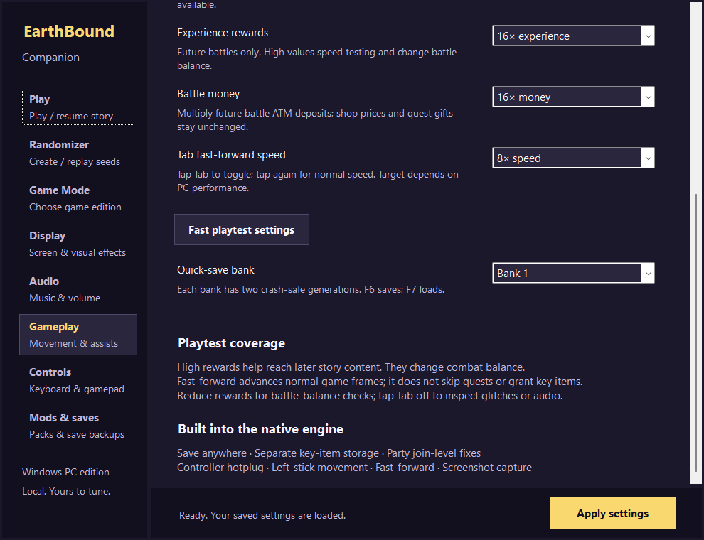

# Faster progression for playtesting

Dev.10 adds reward and fast-forward controls to **Gameplay**. Existing settings keep their values, and installations without a fast-forward setting retain the former 3× target.

**Fast playtest settings** selects 16× battle experience and money, an 8× Tab target, 2× sprint, quick dialogue, disabled homesickness and disabled Dad reminder calls. Click **Apply settings** to enable it. Display options, controller bindings, selected edition and saves are retained. Each control can also be changed separately: rewards support 1×–16×, and Tab supports 2×–16×. Tap Tab to toggle acceleration; tap again to return to normal speed. Fast-forward continues to mute audio.

The target controls both native frame pacing and render skipping. All gameplay frames still run. This does not warp the party, advance story flags, grant quest items, bypass encounters or skip scripted events. Raised rewards affect future battles; they do not directly edit existing levels. Returning rewards to 1× does not undo levels or money already earned. High rewards make a story/progression test less representative of normal combat balance.

## Verification

- 128 prepared reward cases in each edition exercise both actual victory paths, all 16 multipliers and one to four surviving party members. Party splits retain ceiling division. Bounded multiplication and a near-limit ATM deposit avoid integer overflow.
- Native configuration checks verify original defaults, valid high settings and rejection of out-of-range input. Launcher tests check limits, JSON/INI persistence, profile import and old preset behavior.
- Five 960-frame copied-save runs compare the dev.9 player, dev.10 player and observer with normal, 3×, 8× and 16× playback. All serialized sections match after canonicalizing only already reviewed process pointers. Owner save bytes remain unchanged.
- In this dummy-renderer test, normal playback takes about 16.5 seconds, the former 3× target 10.6 seconds, 8× about 3.0 seconds and 16× about 1.5 seconds. These are whole-process measurements on this machine, including startup and restore overhead, not guaranteed rates on another PC or every scene.
- The dev.9 encounter, bicycle and SFX regressions pass again in both editions and player/observer builds.

[Playback/reward evidence](../validation/playtest-speed-dev10.json) · [Build and patch check](../validation/playtest-build-dev10.json) · [Shared reliability checks](../validation/native-reliability-dev10.json)

The corrected game data, state format 16 and story/seed identities are unchanged. Full story/randomized playthroughs, all scenes at high speed and all combat combinations remain unverified. Full MaternalBound Redux compatibility is still unfinished.
