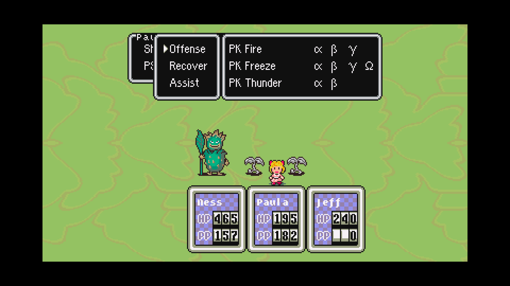

# Dev.21 — battle PSI categories

The native battle PSI menu incorrectly added four categories to a window designed for three. Pagination displayed only Offense on the first page, with a blank gap and an overflow indicator. The original assembly adds exactly Offense, Recover and Assist with `ADD_MENU_ITEM_NO_POSITION`. The native battle menu now follows that source. The four-category Status menu retains Other.

The shared correction applies to Ness, Paula and Poo in Original and Redux. Learned abilities, levels, costs and effects are unchanged. Old F6 checkpoints with the recognizable four-page battle category layout are repainted after PPU/DMA restoration when their category or ability selector is idle. Active ability selection is preserved; unrelated menus and parked frames are guarded. Other transient restore phases can close and reopen the PSI menu normally.

## Executed verification

- [Previous native build](../research/battle-psi-dev21-baseline-fresh.json) reproduces the extra category and pagination for all 15 prepared character/level cases. The [copied reported battle save](../research/battle-psi-dev21-baseline-battle.json) retains the same defect.
- Fifteen category fixtures each in the [player](../research/battle-psi-dev21-player-redux-final.json), [observer](../research/battle-psi-dev21-observer-redux-final.json) and [Original control](../research/battle-psi-dev21-player-original.json): Ness/Paula/Poo at levels 1, 10, 30, 60 and 99.
- Actual platform inputs select all three categories in the copied Paula battle save, comparing every displayed selectable ability ID to the packed learn-level/usability/category records: [player](../research/battle-psi-dev21-navigation-player.json), [observer](../research/battle-psi-dev21-navigation-observer.json). The [previous build fails direct Recover/Assist navigation](../research/battle-psi-dev21-navigation-baseline.json). Rendered captures are 1920 by 1080. These checks do not establish every glyph, action, target or combat outcome.
- [Old open ability selector](../research/battle-psi-dev21-old-ability-final.json) and [actual cold native continuation](../research/battle-psi-dev21-old-ability-replay-final.json) repaint the legacy category backing window.
- [Clean source/runtime provenance](../research/native-runtime-dev21-provenance.json): three source files change from dev.20; both binaries compile from the pinned upstream archive, pinned Tamp submodule and cumulative public patch. The complete 4,312-input comparison normalizes line endings only.

## Enemy fleeing observation

No fleeing rule was changed. The original code compares the combined party levels with enemy level times 6, 8 and 10, and uses a random byte assigned to each spawned enemy in the intermediate ranges. In the copied battle checkpoint, the party sum is 158 and Foppy is level 16. The real native decision returns flee for 192 of 256 prepared spawn values (75%), and no flee for 64. This explains why identical enemies can react differently despite easy battles. Guaranteed level-based fleeing uses a strict greater-than comparison, so Foppies require a combined party level above 160. [Source comparison and prepared decision check](../research/enemy-fleeing-dev21-observation.json). This is not a replay of every roaming AI script or the factory scene.

Game packs, save format 16, seed identities, settings and MSU setup are unchanged. No ROM, assets, soundtrack or saves are included. Full story/randomized playthroughs and complete hardware/pixel/audio coverage remain unverified. Development continues through reported playtesting issues; no autonomous goal or agents are scheduled.
