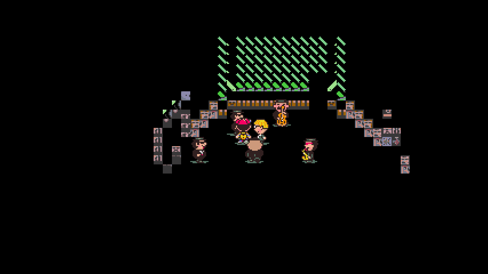
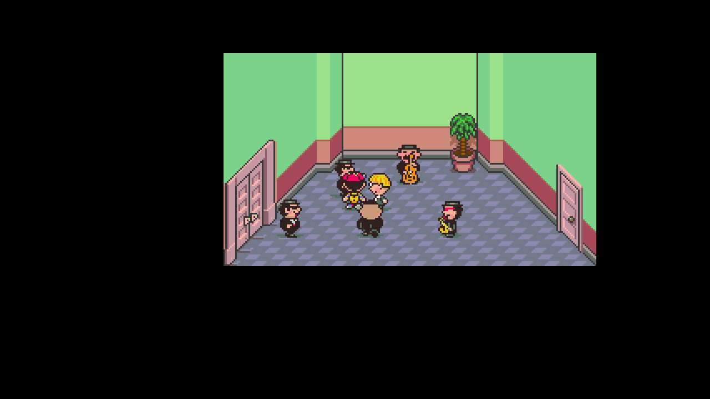

# Dev.22 — post-battle teleport graphics

After Clumsy Robot, the Runaway Five scene could show mostly black background tiles and fragments of walls. The battle had reused overworld VRAM, and its scripted return teleported into the same map tileset. The original teleport invalidates `LOADED_MAP_TILE_COMBO`; the native map loader checked only its additional cache, so it skipped restoring the room graphics.

The shared loader now honors both caches. This follows `asm/overworld/load_map_at_sector.asm` and `asm/overworld/teleport/load_teleport_destination.asm`; it applies to Original and Redux and to other callers that invalidate the original overworld cache. Valid unchanged caches still preserve existing VRAM, including modified tiles. The existing `0x7000` graphics crop remains intact.

## Reported scene

These are actual 1280×720 native captures of the copied reported F6 checkpoint before and after its private graphics recovery.

The fix prevents the bad reload; an old F6 checkpoint also contains the already-broken VRAM. The owner's exact copied checkpoint was repaired privately by replacing only its saved `0x0000–0x6FFF` map-graphics range from the unchanged verified Redux pack. Every other state section, all other PPU bytes, position, party, inventory, story flags and phone save were preserved. Both native binaries cold-load the repair and produce identical screenshots, with the same observed story/gameplay state. [Recovery receipt](../research/map-reload-dev22-copied-save-recovery.json).

This exact-save repair is not included as a release feature. Other affected testers can reload a phone save, or visit an area with a different tileset and return, to rebuild the graphics. Keep an F6 backup if a particular scene needs investigation.

## Executed verification

- Previous builds reproduce the same-cache Clumsy Robot return defect in [Redux](../research/map-reload-dev22-player-redux-baseline.json) and [Original](../research/map-reload-dev22-player-original-baseline.json). Ordinary battle returns remain clean in these controls.
- [Redux player](../research/map-reload-dev22-player-redux-final.json), [Redux observer](../research/map-reload-dev22-observer-redux-final.json) and [Original player](../research/map-reload-dev22-player-original-final.json) each execute five cache states and two complete prepared scripted encounters: Clumsy Robot and an ordinary battle. All corrected returns match the packed background graphics byte-for-byte.
- Cache controls cover valid unchanged caches, overworld-only invalidation, native-only invalidation, both invalidated, and a changed combo. Valid unchanged caches preserve a deliberately modified tile byte rather than needlessly resetting it.
- Old and corrected builds produce identical encounter results, turns, menu choices, attacks, KO records, money and EXP. Player and observer produce identical prepared results. These are real native dispatcher/menu/KO/reward/teleport paths with prepared party/map/flags, not a full natural story run.
- [Complete source and runtime provenance](../research/native-runtime-dev22-provenance.json): exactly one source file changes from dev.21. Both binaries compile from the complete source snapshot; 4,312 source inputs match the current patched source after normalizing line endings only.
- The [copied repaired scene continues with ordinary A inputs](../research/map-reload-dev22-copied-scene-continuation.json) into normal Lucky dialogue. Repeated A interacts again after the original interaction returns; this check does not establish the remainder of the story.

Game packs, save format 16, seed identities, settings and MSU setup are unchanged. Dev.21's PSI fix and prior fixes remain included. The ZIP includes no ROM, extracted assets, soundtrack or saves. Full story/randomized playthroughs and complete pixel, audio, animation and physical-controller coverage remain unverified. No autonomous goal or agents are scheduled.
