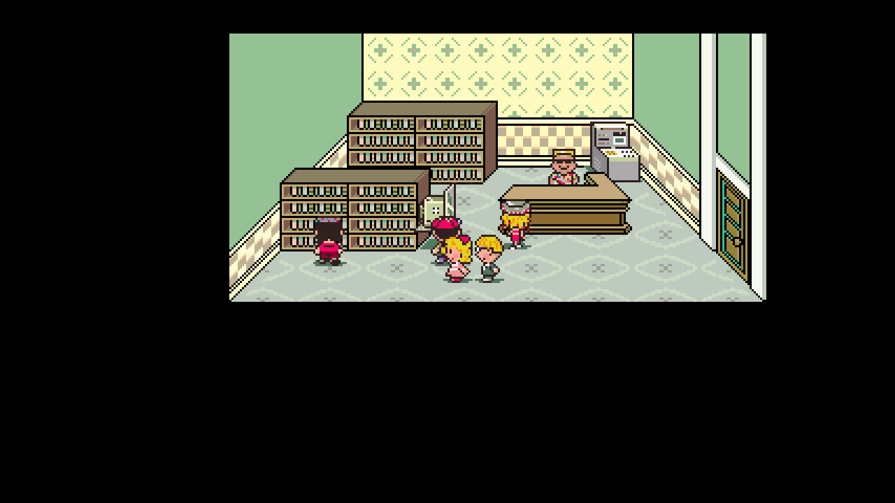

# Dev.23 — preserve returning party progress

Paula could lose levels, stats and PSI when she returned after the Fourside rescue. The native engine's additional first-join catch-up routine ran on every `add_char_to_party` call, including later story reentries. With Ness at level 81, it reset the reported level 65 Paula to level 20. Poo used the same defective path.

The shared native party function now checks the saved historical join bit before key-item migration stamps it. Returning characters keep their progress. First-join catch-up remains available for Paula/Poo when needed, but cannot lower a character already above its target. Jeff remains unchanged. This correction applies to Original and the pinned Redux profile.

The original `asm/misc/party_add_char.asm` does not reset character levels. Redux's rescue script at `l_0xc68264` in `Project/ccscript/data/data_23.ccs` uses `party_add(2)` without a level reset. This was a defect in the native catch-up implementation, not an intended Redux rescue change.

## Saved playthrough recovery

The owner's latest closed F6 checkpoint had already progressed to Paula level 45 after the faulty reset. The historical pre-rescue checkpoint records level 65 and 1,952,297 EXP. The 513,723 EXP subsequently earned is independently confirmed by the matching Ness and Jeff EXP increases. The repair retains that earned EXP: 2,466,020 total, level 70 according to the unchanged packed EXP table.

The private recovery links the unchanged production native library, loads a copied current checkpoint at a root boundary, restores the historical base stats and applies the additional EXP through the normal silent level-up code. Current equipment is used to recalculate derived stats. HP/PP deficits are retained; this particular latest checkpoint was fully healed.

Only Paula's progression and HP/PP bytes in the character-state section change. Her current inventory, equipment, ailments and transient data remain intact; other characters and every other state section, including story flags, position, money and RNG, are byte-identical. Additional growth uses a private copy of the latest RNG; hypothetical alternate historical growth rolls cannot be reconstructed. The owner's live RNG is not advanced. [Exact recovery receipt](../research/party-rejoin-dev23-copied-save-recovery.json).

This is an actual 1280×720 native capture of the latest saved scene after recovery. Level 70 is verified by native state observation, rather than by text added to the image. Player and observer cold-load the copied checkpoint with identical rendered output and unchanged unrelated observed state. [Cold replay evidence](../research/party-rejoin-dev23-cold-replay.json).

The release prevents future resets. It does **not** automatically reconstruct progress already lost in another player's save. Preserve a pre-departure/pre-rescue save and report an affected checkpoint if recovery is needed. The owner's repair is private and is not included as a release cheat.

## Executed verification

- [Prior Redux player](../research/party-rejoin-dev23-player-redux-baseline.json) reproduces the reset on actual native add/remove/readd paths.
- [Corrected Redux player](../research/party-rejoin-dev23-player-redux-final.json), [Redux observer](../research/party-rejoin-dev23-observer-redux-final.json) and [Original player](../research/party-rejoin-dev23-player-original-final.json) each pass 13 prepared live-map cases. These cover returning Paula/Poo at four levels each, already-higher first joins, low-level first joins, Jeff, repeated departures and duplicate joins.
- Compare progression records and native known-PSI masks before/after rejoining. First-join targets still produce Paula level 20 and Poo level 16 for Ness level 81; returning characters keep their existing progress. Player and observer results are identical.
- [Complete source/build provenance](../research/native-runtime-dev23-provenance.json) binds both clean builds and the cumulative public patch. All 4,312 source inputs match the current patched source after normalizing line endings only. One gameplay file changes from dev.22; a second file corrects an existing self-test comment.
- [Exact final ZIP verification](../validation/package-dev23.json) passes the 32-file manifest, ten native runtime checks across Original/Redux and the actual packaged launcher checkpoint-recovery path. Setup helpers and SDL match the previous installed release byte-for-byte.

These fixtures execute production party functions in initialized maps. They do not certify every story script, equipment combination, complete combat animation or full natural playthrough. Historical tests remain labeled with the binaries on which they ran.

Packs, save format 16, seed identities, settings and MSU setup are unchanged. The ZIP includes no ROM, extracted assets, soundtrack or saves. Complete story/randomized playthroughs and comprehensive audio/display/controller coverage remain open. Development follows reported playtesting issues; no autonomous goal or agents are scheduled.
