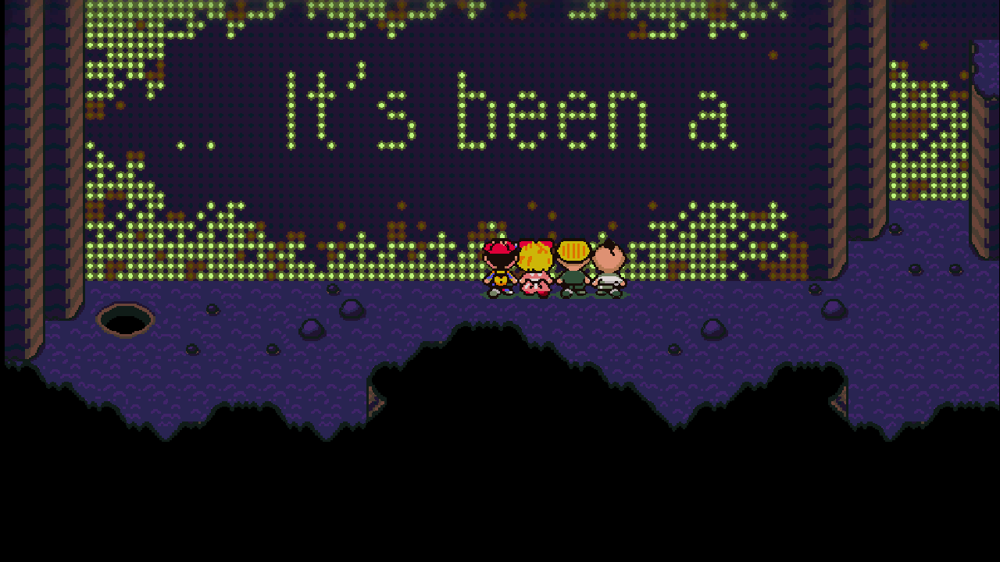

# Dev.24 — fix Lumine Hall wall-writing crash

The game could close after Electro Specter, just before the Lumine Hall wall began displaying Ness’s thoughts. A copied owner checkpoint reproduced the same access violation in dev.23. A debugger watchpoint observed `callroutine_dispatch` writing beyond the entity runtime object while building the wall scroll.

The native port had retained the original assembly’s large decoded buffers after reducing its general-purpose work buffer to 20 KB. Its decoded stream began at offset `$4000`, leaving only 4 KB for roughly 15 KB of data. This corrupted neighboring state before the animation started. This was a native conversion defect, not an intended MaternalBound event change.

The corrected producer uses bounded transient decoding and packs the two four-bit scroll phases into one byte per cell in the existing serialized buffer. A compile-time bound covers the longest supported name. No global layout or save-format change is needed. The text renderer streams completed glyph tiles while retaining the partial tile, includes the US character padding, and avoids wrapping the long body through the circular VWF buffer.

The playback now follows the US `ADVANCE_TILEMAP_ANIMATION_FRAME` phase order. `UPDATE_TILEMAP_REGION` writes the horizontal BG1 overworld map at `$3800/$3C00` and wraps across its two halves. The previous native playback incorrectly wrote the separate BG3 menu tilemap. These corrections are shared by Original and the pinned Redux profile.

Actual 1280×720 capture during the corrected wall animation. The screenshot was rendered by the native game; the letters were not added to the image.

## Executed verification

- [Copied checkpoint replay](../research/lumine-hall-dev24-copied-checkpoint-replay.json): reproduce dev.23’s `C0000005` crash before the animation, then use ordinary replayed inputs in the corrected production player to defeat Electro Specter, walk through the cave, trigger the wall writing, record the melody and return to roaming. Boss flag 196 and melody flag 188 are present. No owner save was edited or advanced.
- Save a copied checkpoint during the active wall animation, start a fresh production process, load it and complete the event. Packed scroll data persists in the existing entity-runtime save section. Save format remains 16.
- Player/observer replays have identical serialized state after canonicalizing rebound window and PSI process addresses. NULL/non-NULL presence is compared; all other bytes match. MSU commands 38 (one-shot) and 31 (loop) are observed. Playback uses dummy SDL audio, so this is command-routing evidence rather than physical listening.
- [Redux player](../research/lumine-scroll-dev24-redux-player.json), [Redux observer](../research/lumine-scroll-dev24-redux-observer.json) and [Original player](../research/lumine-scroll-dev24-original-player.json): six fixtures each cover empty, short, ordinary, narrow, wide and maximum-capacity names. An independent linear glyph canvas models the US font-padding/blit rules and samples 2×2 planar cells. Every production viewport word, BG1 horizontal wrap, unaffected VRAM, retained work-buffer tail and completion result is checked. Together they compare 4,063,200 viewport words across 18 fixtures.
- [Build/source provenance](../research/native-runtime-dev24-provenance.json): only `src/entity/callroutine.c` changes from dev.23. All 4,312 frozen source inputs are compared after line-ending normalization. The cumulative public patch reverse-checks against the pinned native base.
- [Final ZIP verification](../validation/package-dev24.json) records the exact archive, manifest, ten basic native checks across Original/Redux and packaged Companion checkpoint recovery. The final packaged executable also completes the wall event from a copied pre-trigger checkpoint.

The standalone fixture tool is [lumine_scroll_qa_dev24.py](../scripts/lumine_scroll_qa_dev24.py). It links a private driver to the unchanged production library and writes only the specified scratch directory. It needs the existing native build, local pack and setup used by the other native QA scripts.

Owner phone/F6 saves, settings, content profiles, mods and MSU files are retained during installation. Resume the existing pre-boss checkpoint with F7 and repeat the encounter and Lumine Hall event. There is no automatic progression skip or save repair in this release.

The ZIP contains no ROM, extracted playable pack, soundtrack or saves. Full campaign/randomized playthroughs, other story events and complete controller/display/physical-audio coverage remain unverified. Development continues through reported playtesting issues; no autonomous goal or agents are scheduled.
