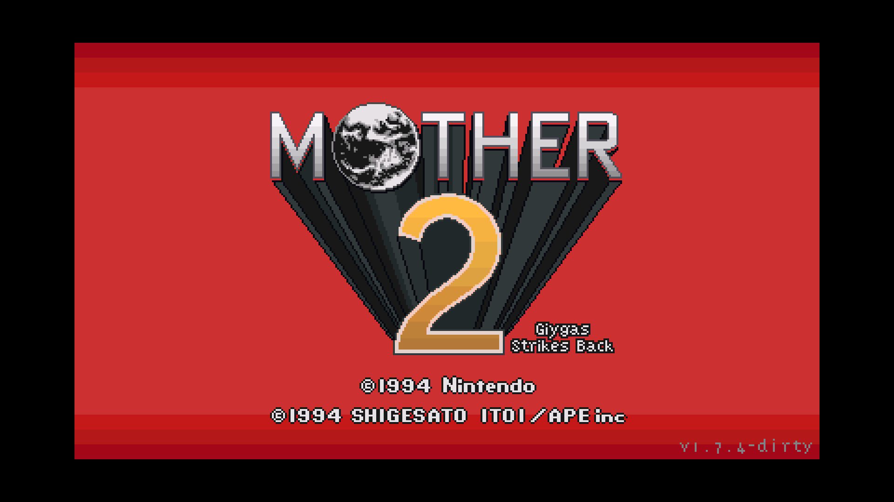
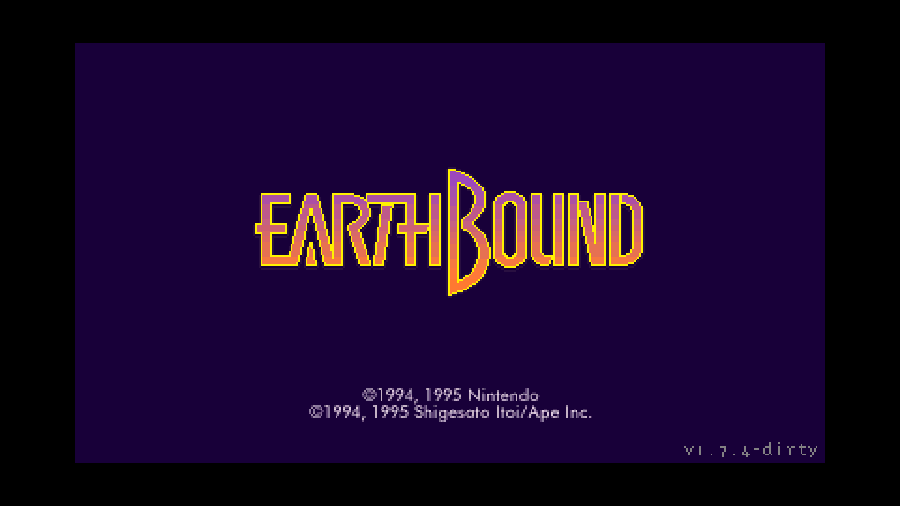

# Redux dev.25 — choose your title screen

In **Game Mode**, enable **Original EarthBound title screen**, click **Apply settings**, then relaunch. Redux retains its story and gameplay; the unchecked default keeps the Redux title. Original mode already uses the EarthBound title. The choice also applies to Redux Story Shuffle launches.

The player uses the Original native data created from your clean USA ROM during normal setup. No extra download, ROM patch, new gameplay pack or save conversion is needed. This option selects ten title presentation entries and eleven title entity entry points at startup. The donor is checked before any entry is replaced; a failed donor leaves the current assets untouched. All other gameplay data and the original/Redux/randomized disk packs keep their identities.

Both the animated and quick title paths are exercised in the production player. The selected title is compared against Original mode's VRAM, palettes and sprite OAM at seven points per path; the default Redux title remains distinct. Private QA checks all ten selected bytes, unrelated asset pointers/lengths, malformed/missing donors and both script-loading orders. Launcher coverage includes story and randomizer launches with the option on/off, settings persistence, save isolation and a copied owner checkpoint.

This release retains the dev.24 Lumine Hall fix and all earlier fixes. Saves remain format 16; the update preserves existing settings, ROM-derived game data, music and saves. It does not advance your playthrough. Complete campaign/randomizer, physical-controller and comprehensive listening coverage remain unverified.

[Game feature list](../README.md#game-features) · [Title verification](../validation/title-screen-option-dev25.json) · [Package verification](../validation/package-dev25.json)

## Actual native captures

Both captures use the same Redux gameplay pack and native dev.25 player at 1920×1080. They are title fixtures, not story progress.

