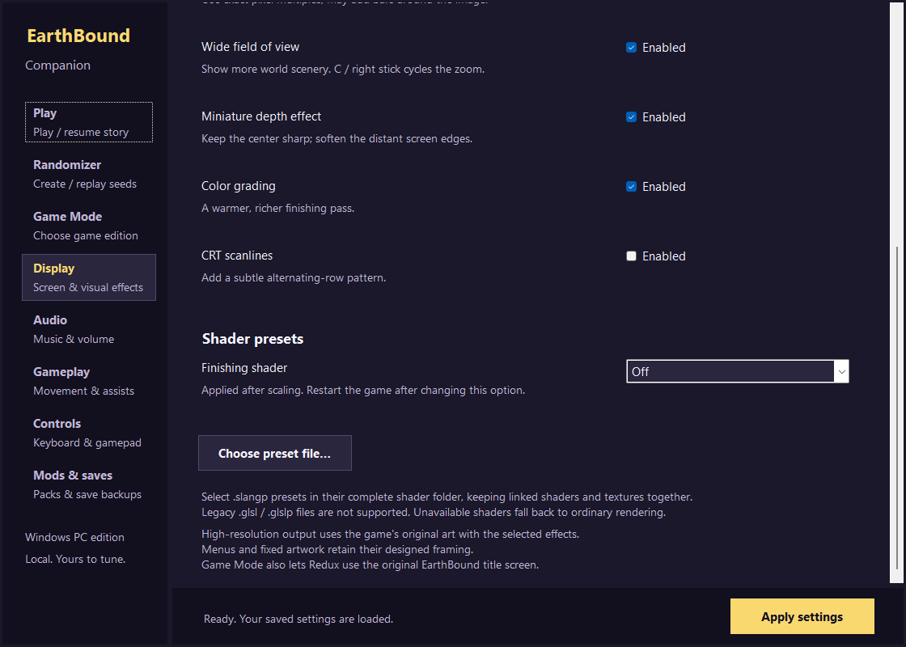

# Dev.33 — scrolling, widescreen encounters and shader presets

This update addresses the three display requests from the Reddit discussion. Game-data packs and save namespaces are retained; no new owner playthrough is required.

## Changes

- Normal movement can advance by fractional pixels, but the camera previously discarded that fraction. The new renderer carries the fraction into background presentation and draws the visible party separately, preserving background occlusion. Game movement, collision and battle timing retain their existing rates. Scripted camera scenes, battles and windows retain their framing. Corrected scrolling is the standard behavior, with no original-scrolling toggle.
- Windows frame waits now use an absolute deadline with a short precision tail, reducing millisecond sleep rounding. Gameplay remains at its existing update rate. This is not an unlocked-FPS engine or a promise to eliminate every source of judder on every display.
- Horizontal enemy spawning now covers the native viewport width. Its old five-cell scan covered the original screen width even when a wider view was displayed. The correction naturally populates the side areas; encounters may therefore occur earlier than they did with the incomplete scan. Randomizer recipe algorithms and save namespaces are unchanged.
- Display settings include Off, Warm, Monochrome and Soft CRT finishing shaders, plus external `.slangp` selection using an optional D3D11 librashader runtime. See [shader usage and limits](../Shaders/README.md). Legacy GLSL presets are unsupported, and shader errors fall back to ordinary rendering.

## Focused evidence

The final candidate is bound to SHA256 `c3596e2e7944471b6f2389a9c61b6af69b3129937e46cbbd1bef7d4daab2097e`.

- Visible movement fixtures cover eight directions, walking, Y sprint at 1.5×/2×, Skip Sandwich alone and combined with both sprint speeds, including actual effect expiry. Tab fast-forward is not the sprint test.
- Actual captured scenery provides a before/after check of uneven camera stepping. Timing measurements are host timestamps, not physical monitor scanout; captured-image registration is a bounded measurement, not universal perceptual certification.
- Normal production spawning shows Onett snakes/crows in the left side area and a dog in the right side area. A copied Underworld checkpoint shows a dinosaur in the right side area. A matching Onett negative fixture using the old spawner has no right-side dog. No actors were hand-created in those proofs.
- Original and Redux encounter, transition, sprint-collision and save-state checks pass on the final candidate. Earlier credits, prayer, PSI and other rendering checks are labeled with the earlier candidate they executed; unchanged renderer object hashes provide the connection, rather than relabeling their execution.
- Shader checks exercise real D3D11 output, supplied presets, identity/inversion/monochrome controls and invalid-preset fallback. Launcher path persistence and preset reset are checked separately.
- Additional shader controls pass for a two-pass chain, window resize down and back up, and missing-runtime fallback. A copied latest owner credits checkpoint also cold-loads on the uninstrumented final player.
- The complete public patch is compiled from the pinned foundation in an isolated tree. Owner saves and settings are backed up and hash-checked around installation.

Prepared coordinates and copied saves do not establish every map, enemy composition or natural story route. No second full campaign, broad hardware matrix, every external shader or monitor scanout was tested. Earlier campaign and licensing limits in [maintenance scope](../MAINTENANCE.md) remain applicable.

[Executed reports](../validation/display-dev33/). The 48 movement cases and eight final encounter/transition/collision/save groups pass; the earlier 20 rendering groups retain their earlier executed identity.

*Actual ROM-free launcher capture; shader selection is Off by default.*
